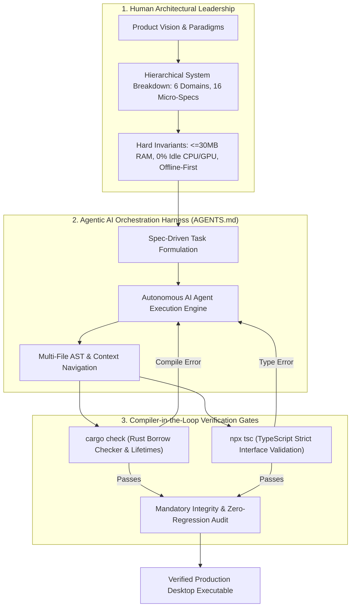
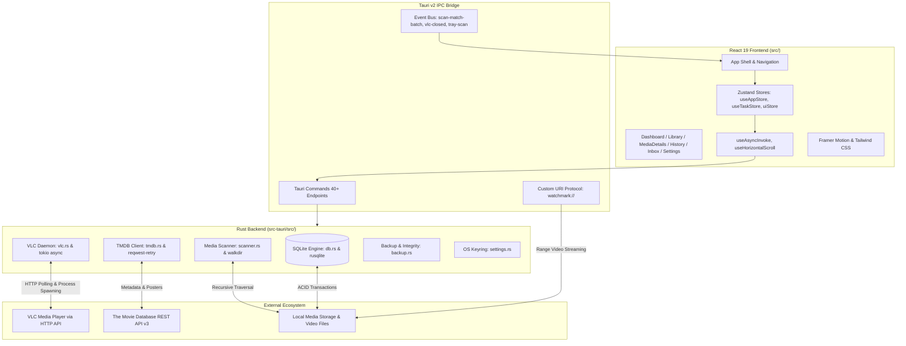

# WatchMark Media Tracker

<div align="center">

[](https://tauri.app/)
[](https://www.rust-lang.org/)
[](https://react.dev/)
[](https://www.typescriptlang.org/)
[](https://tailwindcss.com/)
[](https://www.sqlite.org/)
[](https://www.videolan.org/)
[](https://deepmind.google/)

**A high-performance, cinema-grade personal media tracking diary and local file bridge.**

*Seamlessly bridge online TMDB metadata with your local media storage — with zero server bloat and automatic VLC playhead synchronization.*

[Features](#-core-features) • [Methodology & AI Orchestration](#-engineering-methodology-system-breakdown--agentic-ai-orchestration) • [Resume Highlights](#-resume--portfolio-summary-ready-to-showcase) • [Architecture](#-architecture--tech-stack) • [AI Whitepaper](docs/architecture/AI_ORCHESTRATION.md) • [Documentation](docs/README.md) • [Roadmap](ROADMAP.md) • [Requirements & Installation](#️-requirements--installation) • [Legal & Compliance](#️-legal--dmca-compliance-statement)

</div>

---

## 💡 What is WatchMark?

Media servers like Plex, Emby, and Jellyfin are powerful, but they require heavy background server daemons, continuous CPU transcoding overhead, user accounts, and telemetry.

**WatchMark** takes a fundamentally different approach:
* **Client-Only, Zero Background Daemons:** Runs as a lightweight native desktop app (~30MB idle RAM, 0% idle CPU).
* **The "Media Diary" Paradigm:** Tracks what you own, what you've watched, where you left off, and how you binge — stored locally on your machine in an ACID-compliant SQLite database.
* **Direct VLC Player Telemetry:** Instead of building an internal video player with proprietary codec limitations, WatchMark delegates playback to your local **VLC Media Player**, silently tracking playhead progress, pause events, and completion ratios via VLC's local HTTP API in real-time.
* **Universal TMDB Bridge:** Connects to The Movie Database (TMDB) to fetch rich 4K backdrops, 2:3 posters, season episode lists, cast/crew details, and movie franchise collections, caching everything locally for full offline resilience.

---

## 🎯 Engineering Methodology: System Breakdown & Agentic AI Orchestration

WatchMark was engineered from the ground up as a premier showcase of **Advanced System Breakdown & Human-in-the-Loop Agentic AI Orchestration**. Rather than treating AI as an autocomplete tool, the project operated on a formal **Agentic Systems Engineering Framework** pairing human architectural leadership with autonomous coding agents (Google DeepMind / Antigravity / Jules):



### 1. Hierarchical System Breakdown (The 6 Architectural Pillars)
Complex product requirements were systematically decomposed into 6 decoupled architectural domains, each governed by formal [IEEE 29148 / RFC 2119 specifications](docs/specifications/README.md):
* **Domain 1: OS Shell & Safety Guardrails** — Native desktop lifecycle, AppData canary permission probing, OS Keyring secrets, and off-screen window geometry clamping.
* **Domain 2: Asynchronous Concurrency & IPC** — Tauri v2 IPC bridge, Tokio async runtime, non-blocking UI, `RequestId` cancellation tokens, and Read/Write Mutexes.
* **Domain 3: Local-First ACID Data Layer** — Relational SQLite engine in Write-Ahead Logging (`WAL`) mode, transactional evolutionary migrations, and SHA-256 verified atomic backups.
* **Domain 4: Subprocess Telemetry Engine** — Non-intrusive VLC loopback supervisor, dynamic port probing (`8080–8090`), cryptographic session tokens, and sub-second playhead sync with zero CPU polling.
* **Domain 5: Filesystem Ingestion Pipeline** — Deep recursive directory traversal (`depth 15`), Windows long-path prefixing (`\\?\`), EBNF scene release tokenizer, and a persistent triage inbox.
* **Domain 6: Cinema UI & Hardware GPU Pipeline** — Framer Motion 60 FPS physics, `VirtualPoster` windowing, and GPU compositor optimization eliminating WebView2 rasterization bottlenecks.

### 2. The Agentic Orchestration Protocol (`AGENTS.md`)
Autonomous AI agents were governed by a non-negotiable operational contract:
* **State Synchronization**: Mandatory tracking and state reconciliation against [`todo_list.md`](todo_list.md) preventing scope creep.
* **Strict Physical Boundaries**: Rigid directory isolation between pure Rust backend (`watchmark-tauri/src-tauri/`) and React frontend (`watchmark-tauri/src/`).
* **Compiler-as-a-Verifier**: Eliminated brittle test suites in favor of deterministic **compiler-level static analysis** (`cargo check` & `tsc`). If code failed compilation, the compiler's borrow-checker diagnostics fed directly into the agent's self-correction cycle.
* **Mandatory Integrity Auditing**: Required cross-referencing prompt requirements line-by-line before commit finalization, guaranteeing zero feature regressions across 90+ iterative feature sprints.

### 3. Empirical Case Studies (Low-Level Systems Debugging)
* **Eliminating a 70.3% WebView2 GPU Compositor Bottleneck**: Diagnosed an idle GPU spike where WebView2 pegged the 3D rasterizer at 70.3%. Isolated the root cause to infinite Framer Motion scale transforms executing beneath elements with CSS `backdrop-filter: blur(...)`, forcing Chromium to re-run Gaussian blur pixel shaders at 144Hz. Replaced with static hardware fade-ins, dropping idle GPU to **0.0%**. *(Full details in [AI Orchestration Whitepaper](docs/architecture/AI_ORCHESTRATION.md))*.
* **Zero-CPU Subprocess Telemetry Loop**: Engineered an asynchronous loopback supervisor in Rust communicating with VLC via local HTTP streams, providing sub-second playhead synchronization and $\ge 90\%$ completion tracking while drawing **0.0% background CPU**.

---

## 📄 Resume & Portfolio Summary (Ready to Showcase)

> **WatchMark — High-Performance Desktop Media Tracker & VLC Telemetry Bridge**  
> *Lead Systems Architect & AI Orchestrator* | **Tech Stack:** `Rust, Tauri v2, React 19, TypeScript, SQLite WAL, Tokio, Framer Motion`
> * **System Architecture & Breakdown:** Architected a zero-daemon desktop application (~31MB RAM, 0% idle CPU) decomposing complex media ingestion, VLC player telemetry, and offline-first storage into 6 decoupled architectural domains and 16 formal IEEE 29148 micro-specifications.
> * **Agentic AI Orchestration:** Directed autonomous AI coding agents (Google DeepMind / Antigravity / Jules) across 90+ feature sprints via a custom SOP ([`AGENTS.md`](./AGENTS.md)), enforcing spec-driven prompt decomposition, compiler-in-the-loop verification gates (`cargo check`, `tsc`), and zero-regression audits.
> * **GPU & Performance Optimization:** Profiled and eliminated a 70.3% GPU compositor bottleneck in WebView2 by isolating Chromium Gaussian blur re-rasterization during affine matrix transforms, reducing idle GPU utilization to **0.0% – 1.0%**.
> * **Telemetry & Concurrency Engine:** Engineered an asynchronous Tokio subprocess supervisor dynamically negotiating loopback ports (`8080–8090`) with one-time cryptographic tokens to track sub-second VLC playhead metrics with zero background polling overhead.
> * **ACID Data Layer:** Implemented a relational SQLite engine in WAL mode with evolutionary transactional migrations, SHA-256 verified atomic backups, and 60 FPS DOM viewport virtualization (`VirtualPoster`) for 1,000+ items.

---

## ✨ Core Features

### 🎬 Cinema-Grade User Interface
* **Deep Dark Aesthetic:** Designed around an ultra-dark palette (`#0D0F14`), translucent glassmorphism (`bg-[#1F222A]/60` with `backdrop-blur-md`), and signature VLC Orange accents (`#FF6B00`).
* **Edge-to-Edge Hero Banner:** Immersive 450px backdrop banner featuring multi-stop diagonal gradient fades, bold typography, and a 1-click **Resume Watching** action.
* **"Continue Watching" Carousel:** Snap-scrolling row of wide episode cards with bottom-edge progress bars indicating your exact resume point.
* **Fluid Poster Grids & Virtualization:** High-density 2:3 poster layouts powered by `VirtualPoster` (`IntersectionObserver` windowing) that efficiently unmounts off-screen DOM nodes, allowing 1,000+ shows to render at smooth 60 FPS.
* **Hardware-Accelerated Fluidity:** View switching and accordion transitions powered by `framer-motion` with built-in `prefers-reduced-motion` battery-saving optimizations.

### 📡 Smart VLC Playhead Telemetry (Zero Background CPU)
* **100% Asynchronous Tracking:** Powered by `tokio::process::Command` and `tokio::select!` event loops that consume zero background CPU while watching.
* **Automatic Port Discovery & Secure Auth:** Dynamically probes local ports (8080–8090) to prevent conflicts and generates a cryptographic one-time session password for VLC's HTTP interface.
* **Exact Playhead Resumption:** Remembers your exact position in seconds (`last_position`). Launching an episode resumes playback precisely where you left off via VLC's `--start-time` flag.
* **Intelligent Completion Thresholds:** Automatically marks an episode as "Completed" and increments rewatch counts when you watch **≥ 90%** of the runtime or close VLC within **120 seconds** of the end credits.
* **Auto-Session Chaining & Isolation:**
  * Episodes watched consecutively within **6 hours** (< 21,600s) are automatically linked into a unified Binge Session UUID.
  * Switching to a different show immediately isolates the session and mints a fresh session ID.

### 📖 History Diary & Binge Timeline
* **Interactive BingeBlock Accordions:** Groups multi-episode binges into master-detail accordions with show titles, episode counts, total duration, and smooth auto-height physics.
* **Midnight Crossover Detection:** Calculates UNIX epoch timestamps; if a binge spans past midnight, a distinct `<Moon />` indicator is displayed alongside the duration metadata.
* **Detailed Sub-Episode Breakdown:** Displays individual watch durations, pause frequency counters, and 16:9 thumbnail fallbacks.
* **Auto-Scroll Anchor Override:** Automatically ensures expanding an accordion keeps the header locked in the viewport.

### 📁 High-Performance Media Scanner & Triage Inbox
* **Blazing-Fast Recursive Scanner:** Traverses nested folders in milliseconds using Rust's `walkdir` and multi-pattern regex (`S01E01`, `1x01`, `Ep 01`, etc.).
* **Windows Long Path & Shortcut Support:** Seamlessly handles deep paths via Windows `\\?\` prefixing and resolves Windows `.lnk` shortcuts using `parselnk`.
* **Chunked IPC Streaming:** Batches file scans in groups of 50 (`scan-match-batch`) to eliminate memory spikes and prevent UI lockups during massive library scans.
* **Persistent Triage Inbox:** Unmatched files are parsed and grouped by extracted title into a dedicated triage inbox for 1-click matching or manual linking.

### 🛡️ Robust SQLite Engine & Data Integrity
* **ACID Relational Storage:** Managed with `rusqlite` in Write-Ahead Logging mode (`PRAGMA journal_mode = WAL;`, `PRAGMA synchronous = NORMAL;`, `PRAGMA foreign_keys = ON;`).
* **Evolutionary Migration System:** Safe `ALTER TABLE` migrations automatically update database structures without touching existing user ratings, watch counts, or history.
* **Atomic Backup & Restore:** In-app one-click database backups with SHA-256 checksum verification, automated backup rotation, and safe restore routines.
* **Database Optimization:** Built-in SQLite `VACUUM` and `PRAGMA optimize` maintenance tools to keep database queries instantaneous.
* **OS Credential Manager (Keyring):** Stores TMDB API keys securely in the Windows Credential Manager, macOS Keychain, or Linux Secret Service, with fallback support for `TMDB_API_KEY` environment variables.

---

## 🏗️ Architecture & Tech Stack



### Technology Matrix

| Layer | Technologies | Purpose |
| :--- | :--- | :--- |
| **Desktop Shell** | Tauri v2.10, Microsoft WebView2 | Native OS windowing, system tray, global shortcuts, custom URI protocols |
| **Backend Core** | Rust 2021, Tokio 1.50, Rusqlite 0.38 | Asynchronous runtime, SQLite connection pooling, memory safety |
| **Frontend UI** | React 19, TypeScript 5.8, Vite 7 | Component architecture, strict type safety, fast HMR |
| **Styling** | Tailwind CSS 3.4, Framer Motion 12 | Cinematic glassmorphism, responsive grid, 60 FPS transitions |
| **State & Alerts** | Zustand 5, Sonner | Global task & UI state management, non-blocking toast notifications |
| **Telemetry** | Reqwest, Reqwest-Retry, Tracing | Resilient HTTP polling, structured diagnostic file logging |
| **Security** | Keyring 3.6, Windows-sys | Native OS Credential Storage, Long-Path handling |

---

## 📚 Technical Documentation & Specifications

WatchMark features an enterprise-grade technical documentation suite authored in compliance with [ISO/IEC/IEEE 29148:2018](https://standards.ieee.org/ieee/29148/7292/) and [RFC 2119](https://datatracker.ietf.org/doc/html/rfc2119) standards:

* 🏛️ [**System Design & Architecture (`docs/architecture/`)**](./docs/architecture/SYSTEM_DESIGN.md): Multi-process topologies, 0% CPU async loops, and [relational SQLite schema](./docs/architecture/DATABASE_SCHEMA.md).
* 📑 [**Technical Specifications Suite (`docs/specifications/`)**](./docs/specifications/README.md):
  * [**01: Core Shell, Lifecycle & OS Boundaries**](./docs/specifications/01_CORE_SHELL_AND_STORAGE.md) — App bootstrapping, canary probe, OS Keyring, and geometry clamping.
  * [**02: Database Engine, WAL Concurrency & Integrity**](./docs/specifications/02_DATABASE_AND_CONCURRENCY.md) — WAL concurrency, transactional migrations, and SHA-256 backup verification.
  * [**03: TMDB Metadata Engine & Synchronization**](./docs/specifications/03_TMDB_METADATA_ENGINE.md) — Upstream wire protocol, token-bucket limiter ($40\text{ req}/10\text{s}$), and 3-tier image caching.
  * [**04: High-Speed Media Scanner & Triage Inbox**](./docs/specifications/04_MEDIA_SCANNER_AND_INBOX.md) — Recursive traversal (depth 15), Windows long paths, hardware cycle prevention, EBNF token grammar, and triage inbox.
  * [**05: VLC Telemetry & Playback Orchestration**](./docs/specifications/05_VLC_TELEMETRY_AND_PLAYBACK.md) — Process supervisor, dynamic socket probe ($8080\dots8090$), completion thresholds ($\ge 90\%$), and 6-hour binge clustering.
  * [**06: Cinema UI Design System & Virtualization**](./docs/specifications/06_CINEMA_UI_AND_COMPONENTS.md) — Semantic dark tokens, `VirtualPoster` windowing ($<50\text{MB}$ at $1,000+$ items), spoiler blur, and battery-saving mode.
* 🧪 [**Quality Assurance Matrix (`docs/testing/`)**](./docs/testing/TEST_MATRIX.md): Exhaustive test matrix for permissions, power loss, paths $>260$ chars, and recovery behaviors.
* 💻 [**Developer Guides (`docs/dev/`)**](./docs/dev/LOCAL_DEVELOPMENT.md): [Local development](./docs/dev/LOCAL_DEVELOPMENT.md) and [AI-assisted engineering methodology disclosure](./docs/dev/AI_WORKFLOWS.md).

---

## 📂 Repository Structure

```text
timestampet/
├── LICENSE                         # Official MIT Open Source License
├── CHANGELOG.md                    # SemVer release and feature history
├── ROADMAP.md                      # Project milestone roadmap
├── CONTRIBUTING.md                 # Contribution standards and PR guidelines
├── SECURITY.md                     # Security policy and vulnerability reporting
├── AGENTS.md                       # AI pairing & Jules Agent operating procedure
├── docs/                           # Architecture, Specifications & QA Hub
│   ├── README.md                   # Central documentation navigation hub
│   ├── architecture/               # System design, topologies, and database schemas
│   ├── specifications/             # Production-grade IEEE 29148 / RFC 2119 specs
│   ├── testing/                    # QA matrices, boundary tests, and failure modes
│   └── dev/                        # Developer guides and AI workflow disclosures
└── watchmark-tauri/                # Primary Tauri 2.0 Project Root
    ├── package.json                # Node.js dependencies & scripts
    ├── tailwind.config.js          # Cinema-grade color palette & safe-lists
    ├── vite.config.ts              # Vite bundler configuration
    ├── src/                        # React Frontend Source
    │   ├── App.tsx                 # Root application shell & sidebar navigation
    │   ├── index.css               # Global typography & glassmorphism utilities
    │   ├── components/
    │   │   ├── Dashboard.tsx       # Edge-to-edge hero, continue watching, stats
    │   │   ├── Library.tsx         # Media collection grid with filtering/sorting
    │   │   ├── MediaDetails.tsx    # Deep-dive show/movie view, seasons, cast
    │   │   ├── History.tsx         # Watch history timeline & infinite scroll
    │   │   ├── BingeBlock.tsx      # Binge-session accordion & midnight crossover
    │   │   ├── InboxView.tsx       # Unmatched media file triage & linker
    │   │   ├── SearchTMDB.tsx      # Universal live TMDB search modal
    │   │   ├── SettingsView.tsx    # Master-detail settings & maintenance panel
    │   │   └── ui/                 # Reusable UI widgets (VirtualPoster, SafeImage, Modal)
    │   ├── hooks/                  # Custom React hooks (useAsyncInvoke, useHorizontalScroll)
    │   ├── store/                  # Zustand stores (useAppStore, useTaskStore, uiStore)
    │   └── utils/                  # Path formatters, date utilities, toast helpers
    └── src-tauri/                  # Pure Rust Backend Source
        ├── Cargo.toml              # Rust crate dependencies & release profiles
        ├── tauri.conf.json         # Tauri v2 capabilities, window sizes, protocols
        └── src/
            ├── main.rs             # Tauri lifecycle, system tray, custom URI protocols
            ├── commands.rs         # 40+ Tauri IPC endpoints
            ├── db.rs               # SQLite schema, WAL mode, migrations, pooling
            ├── vlc.rs              # Tokio async VLC launcher, polling & binge logic
            ├── scanner.rs          # Recursive walkdir scanner & regex parsers
            ├── tmdb.rs             # Async TMDB API client & image caching
            ├── settings.rs         # Persistent settings & OS Keyring integration
            ├── backup.rs           # SQLite atomic backup, restore & SHA-256 checks
            ├── task_queue.rs       # Background task coordinator
            └── logging.rs          # Multi-level structured file logging
```

---

## 🛠️ Requirements & Installation

### System Prerequisites

| Dependency | Minimum Version | Required For | Installation Guide |
| :--- | :--- | :--- | :--- |
| **Node.js** | `>= 20.0.0` (LTS) | React 19 Frontend & Vite 7 Bundler | [nodejs.org](https://nodejs.org/) (includes `npm`) |
| **Rust & Cargo** | `>= 1.80.0` (2021 Edition) | Native Backend & SQLite Concurrency Engine | [rustup.rs](https://rustup.rs/) (`rustup default stable`) |
| **VLC Media Player** | `>= 3.0.0` | Subprocess Playhead Telemetry & Hardware Playback | [videolan.org](https://www.videolan.org/vlc/) |
| **TMDB API Key** | v3 Developer Key | Metadata, Posters, Season Details & Air Dates | [themoviedb.org](https://www.themoviedb.org/settings/api) (Free Account) |
| **C++ Build Tools** | MSVC (Win) / GCC (Linux) | Native Desktop Windowing & SQLite C-Bindings | Platform Specific (see below) |

#### Platform-Specific OS Toolchains
* **Windows**: Install the **C++ Build Tools** via the [Visual Studio Installer](https://visualstudio.microsoft.com/visual-cpp-build-tools/) (select *"Desktop development with C++"*).
* **Linux (Ubuntu/Debian)**:
  ```bash
  sudo apt update
  sudo apt install -y build-essential curl wget file libssl-dev libgtk-3-dev libwebkit2gtk-4.1-dev libayatana-appindicator3-dev librsvg2-dev
  ```
* **macOS**: Install Xcode Command Line Tools:
  ```bash
  xcode-select --install
  ```

---

### Step-by-Step Installation & Setup

#### 1. Clone the Repository
```bash
git clone https://github.com/Headhunte-121/timestampet.git
cd timestampet/watchmark-tauri
```

#### 2. Install Frontend Dependencies
```bash
npm install
```

#### 3. Run in Local Development Mode (HMR Enabled)
To launch the desktop application with live Hot Module Replacement (Vite) and incremental Rust compilation:
```bash
npm run tauri dev
```
* The Vite dev server starts on `http://127.0.0.1:1420`.
* The Rust backend automatically initializes SQLite in WAL mode and opens the native WatchMark window.
* Diagnostic logs are piped to stdout and written to `%LOCALAPPDATA%\WatchMark\watchmark.log`.

---

### 📦 Compiling a Standalone Production Executable

To compile a fully optimized, standalone desktop executable with Link-Time Optimization (LTO):

```bash
cd watchmark-tauri
npm run tauri build
```

The compiled release packages are output to:
* **Windows:** `watchmark-tauri/src-tauri/target/release/watchmark-tauri.exe` (and NSIS installer in `bundle/nsis/`)
* **macOS:** `watchmark-tauri/src-tauri/target/release/bundle/macos/WatchMark.app` (and `.dmg`)
* **Linux:** `watchmark-tauri/src-tauri/target/release/bundle/deb/` (and `.AppImage`)

---

## 🚀 User Guide

### 1. Initial Setup
1. Open WatchMark and click **⚙️ Settings** on the bottom-left sidebar.
2. In the **General** tab, enter your **TMDB API Key** and click **Save Settings**.
   * *Tip: You can also set a `TMDB_API_KEY` system environment variable.*
3. In the **Playback** tab, verify your **VLC Executable Path**. WatchMark automatically checks common directories (e.g. `C:\Program Files\VideoLAN\VLC\vlc.exe`), but you can click **Browse** to select it manually.

### 2. Adding Shows & Movies to Your Tracker
1. Click **🔍 Search** in the sidebar (or press the search icon in the top header).
2. Search for any show or movie title (e.g., *Breaking Bad* or *Interstellar*).
3. Click **+ Add to Tracker**. WatchMark downloads all season and episode metadata, cast, crew, synopsis, and artwork into your local database.

### 3. Scanning Local Directories
1. Navigate to the **Inbox** tab.
2. Click **Scan Directory** (or use the global shortcut `Ctrl + Shift + S`).
3. Select your local folder containing your video files (e.g. `D:\Media\TV Shows`).
4. WatchMark recursively scans filenames, extracts season/episode identifiers, and links matching files directly to your tracked shows.

### 4. Resolving Unmatched Files (Triage)
* Files that do not automatically match appear in the **Inbox** grouped by their parsed title.
* Click on a group to inspect the files.
* Click **+ Search TMDB & Add Tracker** to find the right show, or choose **Assign to Existing Show** to link the files instantly.

### 5. Watching Media & Tracking Progress
1. Open any show in your **Library** or click **Resume** on the **Dashboard**.
2. Episodes with a linked local file display an orange **▶ Play** button.
3. Click Play — WatchMark launches VLC at your exact resume position.
4. Watch normally! When you close VLC:
   * **Watched < 90%:** Progress bar updates to your exact stop time.
   * **Watched ≥ 90%:** Marked as completed, watch count increments, and your History log updates.

### 6. Reviewing History & Binge Sessions
1. Navigate to **📜 History** in the sidebar.
2. View your chronological watch diary.
3. Binge sessions are automatically bundled into collapsible **BingeBlocks** with total episodes watched, duration, and midnight crossover indicators.

---

## 🔧 Settings & Database Maintenance

| Tab | Feature | Description |
| :--- | :--- | :--- |
| **General** | **TMDB API Key** | Securely stored in OS Credential Manager (Keyring) |
| **General** | **Cinema Mode** | Toggles full 60 FPS animation physics vs. low-power/reduced-motion |
| **Playback** | **VLC Path** | Configures absolute path to `vlc.exe` or binary |
| **Playback** | **Auto-Launch** | Automatically focus VLC window upon playback trigger |
| **Scanner** | **Default Directory** | Pre-configures root media path for 1-click scans |
| **Advanced** | **Optimize Database** | Executes SQLite `VACUUM` and `PRAGMA optimize` to reclaim disk space |
| **Advanced** | **Backup Database** | Creates an atomic backup with SHA-256 integrity verification |
| **Advanced** | **Restore Database** | Restores database from a previous `.db` backup file |
| **Advanced** | **Export Data** | Export watch history and library data to JSON / CSV |

---

## ❓ Troubleshooting & FAQ

### Q: VLC opens, but my watch progress is not saving.
**A:** WatchMark communicates with VLC using its local HTTP interface.
1. WatchMark automatically binds a free port between `8080` and `8090`. Ensure your local firewall does not block loopback TCP connections (`127.0.0.1`).
2. Verify that no other software is locking all ports in the range `8080–8090`.
3. If you have custom Lua interface scripts in VLC, ensure your VLC preferences under `Tools > Preferences > Show All > Interface > Main interfaces` are set to default.

### Q: Why are some files placed in the Inbox instead of matched automatically?
**A:** The scanner parses standard scene and release conventions:
* Standard Season/Episode: `Show.Name.S01E05.mkv`, `Show_Name_1x05.mp4`
* Absolute/Anime format: `[Group] Show Name - 05 [1080p].mkv`
* Daily format: `Show.Name.2024.03.15.mkv`

If a file has irregular naming (e.g. `ep5_final_edit.mp4`), WatchMark places it safely into the **Inbox** so you can match it with 1 click without corrupting your library.

### Q: Where is my data stored?
**A:** WatchMark stores all data locally in your operating system's native application data folder:
* **Windows:** `%LOCALAPPDATA%\WatchMark\` (e.g., `C:\Users\<User>\AppData\Local\WatchMark\`)
* **macOS:** `~/Library/Application Support/com.WatchMark.WatchMark/`
* **Linux:** `~/.local/share/WatchMark/`

This folder contains:
* `watchmark.db`: Your SQLite relational database.
* `settings.json`: Application preferences.
* `watchmark.log`: Detailed diagnostic logs.
* `cache/`: Cached TMDB posters, backdrops, and episode thumbnails.
* `backups/`: In-app database backups.

### Q: Is an internet connection required?
**A:** **No.** An internet connection is only needed when searching TMDB for new shows or downloading metadata. Once added, your library, history, playhead tracking, and local playback function completely offline.

---

## ⚖️ Legal & DMCA Compliance Statement

**WatchMark is strictly a personal, client-side media cataloging diary and offline library manager.**
* **No Content Hosting, Streaming, or Distribution:** WatchMark does not host, provide, stream, download, scrape, or distribute any copyrighted video, audio, or media files.
* **User-Owned Media Files Only:** The application operates exclusively as a local metadata viewer and organizer for legally acquired, user-owned media files residing on the user's personal storage devices.
* **Official API Compliance:** All show, movie, and episode metadata and artwork are retrieved strictly via the official [The Movie Database (TMDb) API](https://www.themoviedb.org/documentation/api) in full compliance with TMDb's API Terms of Service. This product uses the TMDb API but is not endorsed or certified by TMDb.
* **Zero Third-Party Scraping or Piracy Mechanisms:** WatchMark does not contain any web-scraping utilities, torrent protocols, peer-to-peer distribution networks, bypass modules, or circumvention tools.

---

## 📜 License

This project is licensed under the **MIT License** — see the [LICENSE](LICENSE) file for details.

---

<div align="center">
  <sub>Built with ❤️ using Tauri 2.0, Rust, React, and VLC.</sub>
</div>

