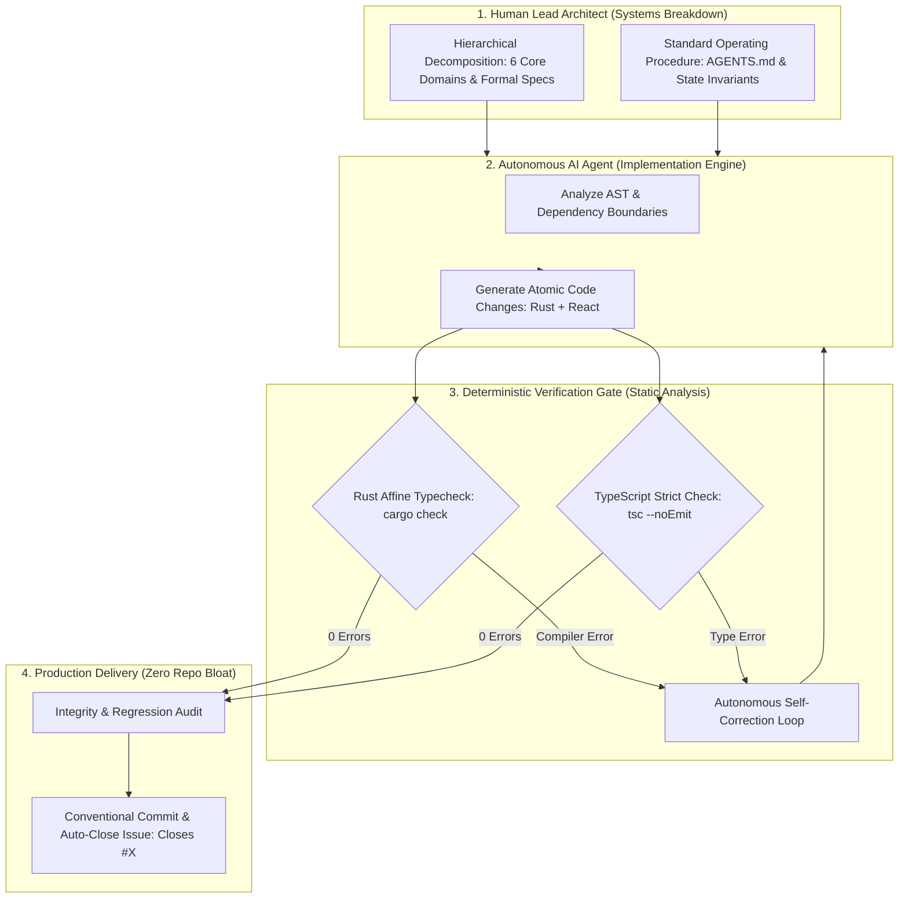
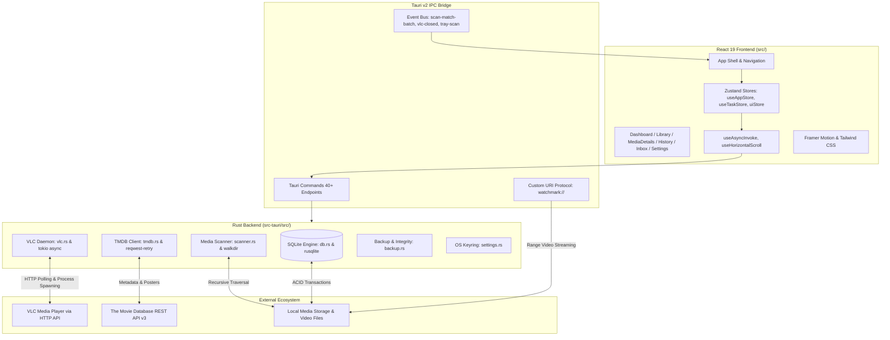

# WatchMark Media Tracker

<div align="center">

[](https://tauri.app/)
[](https://www.rust-lang.org/)
[](https://react.dev/)
[](https://www.typescriptlang.org/)
[](https://tailwindcss.com/)
[](https://www.sqlite.org/)
[](https://www.videolan.org/)
[](docs/architecture/AI_ORCHESTRATION.md)
[](LICENSE)

**A high-performance desktop media diary and VLC telemetry bridge — engineered through an advanced Human-in-the-Loop AI Orchestration Framework.**

*Bridging online TMDb metadata with local files and real-time VLC playback tracking, serving as a dual-purpose software product and empirical demonstration of autonomous systems engineering.*

[AI Orchestration Framework](#-ai-orchestration-framework--systems-breakdown) • [Core Features](#-application-features) • [Architecture](#-architecture--tech-stack) • [Case Studies](#-empirical-case-studies-ai-orchestration-in-action) • [Installation](#️-requirements--installation) • [Documentation](docs/README.md) • [Roadmap](ROADMAP.md) • [License](#-license)

</div>

---

## 🎯 Project Overview & Dual Purpose

**WatchMark** was conceived and engineered with a dual focus:

1. **The Software Product:** A cinema-grade, client-side personal media tracking diary and local file player bridge. It solves the bloat of traditional media servers (Plex, Jellyfin) by operating entirely locally with **zero background daemons, ~30MB idle RAM, 0% idle CPU**, and direct, non-intrusive playhead telemetry via your local **VLC Media Player**.
2. **The Systems Engineering Experiment:** A transparent, reproducible demonstration of **Human-in-the-Loop AI Orchestration**. Rather than writing code ad-hoc or treating Generative AI as a simple auto-complete tool, the project explores how a **Student Systems Architect** can formally decompose a 64-feature product into strict architectural domains, directing autonomous AI agents through **compiler-in-the-loop verification gates** (`cargo check` and `tsc`) and explicit Standard Operating Procedures ([`AGENTS.md`](AGENTS.md)).

---

## 🤖 AI Orchestration Framework & Systems Breakdown

The primary failure mode in modern AI-assisted software engineering is **context collapse**: feeding an autonomous agent monolithic, underspecified tasks resulting in hallucinated abstractions, architectural drift, and regressions.

WatchMark solved this through a rigorous 3-tier **Agentic Systems Engineering Harness**:



### The 3 Core Pillars of the Methodology

#### 1. Hierarchical Systems Breakdown (Domain Isolation)
To maintain razor-sharp agent focus, the 64-feature product roadmap was broken down into 6 decoupled architectural domains:
* **OS Shell & Boundaries:** Native windowing, system tray, crash guards, and geometry clamping.
* **Async Concurrency:** Tauri v2 IPC bridge, Tokio async runtime, and non-blocking I/O.
* **ACID Data Persistence:** Relational SQLite storage, Write-Ahead Logging (`WAL`), and transactional schema migrations.
* **Subprocess Telemetry:** VLC process supervision, dynamic socket probing (`8080..8090`), and playhead tracking.
* **Filesystem Ingestion:** Multi-threaded directory traversal (`walkdir`), regex tokenization, and triage staging.
* **Cinema UI & GPU Optimization:** Viewport virtualization (`VirtualPoster`), Framer Motion layout springs, and compositor tuning.

#### 2. Compiler-as-a-Verifier (Eliminating AI Hallucinations)
Instead of relying on slow, brittle automated unit tests that agents can easily cheat or mock, WatchMark enforced **compiler-level static analysis as a deterministic verification gate**:
* **Rust Affine Type System:** Guarantees memory safety, thread safety, and data-race freedom at compile time. If an agent hallucinates a lifetime or borrowing violation, `cargo check` rejects it instantly.
* **TypeScript Strict Mode:** Ensures IPC payload schemas between Rust backend commands and React Zustand stores never drift out of synchronization.

#### 3. Jules Agent Standard Operating Procedure ([`AGENTS.md`](AGENTS.md))
Every agent invocation operated under a non-negotiable contract:
* **Native GitHub Linkage:** Work implemented exclusively against granular GitHub Issues and Milestones.
* **Clean Conventional Commits:** Auto-close issues natively (`feat(vlc): dynamic port probing. Closes #14`).
* **Zero Repo Bloat:** Never commit binaries (`.exe`), bulky markdown tracking files, or prompt logs into Git tracking.

---

## 🔬 Empirical Case Studies: AI Orchestration in Action

The effectiveness of this orchestration methodology is proven by complex, low-level technical challenges diagnosed and resolved during development:

### Case Study 1: The 70.3% GPU Compositor Bottleneck in WebView2
* **The Problem:** In Cinema Mode, the idle desktop app consumed **70.3% GPU utilization** in Windows Task Manager, dropping to 0% when animations were turned off.
* **Orchestration Diagnosis:** The human architect isolated the issue to frontend render loops. Directing the agent to inspect the DOM compositor tree revealed an infinite 30-second CSS scale transform (`[1, 1.15, 1]`) in `SafeImage.tsx` running on the 4K backdrop image.
* **Low-Level Root Cause:** Because this high-resolution image was continuously scaling behind elements styled with CSS `backdrop-filter: blur(...)` and gradient overlays, Chromium's GPU compositor was forced to re-rasterize Gaussian blur convolution passes on every single monitor refresh frame (144Hz).
* **Engineering Solution:** The agent replaced the infinite affine scale loop with a hardware-accelerated static fade-in. Once mounted, the scale locks at `1.0`. Static high-contrast styling replaced infinite `animate-pulse` tags.
* **Outcome:** **Idle GPU utilization dropped from 70.3% to 0.0% – 1.0%.**

### Case Study 2: Zero-CPU Subprocess Telemetry Loop
* **The Problem:** Monitoring an external video player typically involves busy-waiting or thread sleep loops that waste CPU cycles and battery.
* **Orchestration Design:** Architected an asynchronous child process supervisor in `src-tauri/src/vlc.rs` using `tokio::process::Command` and `tokio::select!`.
* **Technical Implementation:** The agent implemented dynamic loopback port probing (`8080..8090`) to prevent socket collisions, generated cryptographic one-time HTTP passwords, and polled VLC's status over non-blocking HTTP streams.
* **Outcome:** **0.0% background CPU consumption** during active media playback, saving exact-second positions and detecting ≥90% completions.

### Case Study 3: 8-Dimensional Hero Recommendation Scoring Engine
* **The Problem:** Initial versions displayed a single static show in the hero banner, missing opportunities to recommend in-progress series, newly aired episodes, or season finales.
* **Orchestration Design:** Specified an 8-dimensional candidate scoring algorithm implemented in Rust:
  $$\text{Score} = \text{Resume}(+200\text{k}) + \text{FreshAir}(+150\text{k}) + \text{Finale}(+100\text{k}) + \text{Recency} + \text{BingeVelocity} + \text{LocalFile}$$
* **Outcome:** A fluid hero spotlight carousel with 8-second auto-rotation, smooth crossfades, and automatic fallback backfill across the user's library.

---

## ✨ Application Features

### 🎬 Cinema-Grade Desktop Interface
* **Deep Dark Aesthetic:** Designed around an ultra-dark palette (`#0D0F14`), translucent glassmorphism (`bg-[#1F222A]/60` with `backdrop-blur-md`), and signature VLC Orange accents (`#FF6B00`).
* **Edge-to-Edge Hero Banner:** 450px backdrop banner featuring multi-stop diagonal gradient fades, bold typography, and a 1-click **Resume Watching** action.
* **"Continue Watching" Carousel:** Snap-scrolling row of wide episode cards with bottom-edge progress bars indicating your exact resume point.
* **DOM Virtualization (`VirtualPoster`):** High-performance `IntersectionObserver` windowing engine unmounting off-screen DOM nodes, allowing 1,000+ shows to render at smooth 60 FPS under 50MB RAM.
* **Hardware-Accelerated Fluidity:** View switching and accordion transitions powered by `framer-motion` with built-in `prefers-reduced-motion` battery-saving support.

### 📡 Smart VLC Playhead Telemetry (Zero Background CPU)
* **100% Asynchronous Tracking:** Powered by `tokio::process::Command` and `tokio::select!` event loops consuming zero background CPU while watching.
* **Dynamic Loopback Port Probing:** Automatically detects free local ports between `8080` and `8090` to avoid conflicts, generating a cryptographic one-time session password.
* **Exact-Second Playhead Resumption:** Remembers your exact position in seconds (`last_position`). Launching an episode resumes playback seamlessly via VLC's `--start-time` flag.
* **Intelligent Completion Thresholds:** Automatically marks episodes as completed and increments rewatch counts when you watch **≥ 90%** of the runtime or exit within **120 seconds** of the end credits.
* **Auto-Session Chaining & Isolation:**
  * Episodes watched consecutively within **6 hours** (< 21,600s) are linked into a single cohesive Binge Session UUID.
  * Switching to a different television series immediately terminates the chain and mints a fresh session ID.

### 📖 History Diary & Binge Timeline
* **Interactive BingeBlock Accordions:** Groups multi-episode binges into master-detail accordions with show titles, episode counts, total duration, and smooth auto-height physics.
* **Midnight Crossover Detection:** Calculates UNIX epoch timestamps; if a binge spans past midnight, a distinct `<Moon />` indicator is displayed alongside duration metadata.
* **Detailed Episode Breakdown:** Inspect individual watch timestamps, durations, and pause frequency counters.

### 📁 High-Performance Media Scanner & Triage Inbox
* **Blazing-Fast Directory Traversal:** Recursively scans thousands of nested folders in milliseconds using Rust's `walkdir` and multi-pattern regex (`S01E01`, `1x01`, `Ep 01`, etc.).
* **Windows Long Path & Shortcut Support:** Seamlessly handles deep paths via Windows `\\?\` prefixing and resolves `.lnk` shortcuts using `parselnk`.
* **Chunked IPC Streaming:** Batches file scans in groups of 50 (`scan-match-batch`) to eliminate memory spikes and prevent UI lockups during massive library scans.
* **Persistent Triage Inbox:** Unmatched files are parsed and grouped by extracted title into a dedicated triage inbox for 1-click matching or manual linking.

### 🛡️ Local-First SQLite Engine & Data Integrity
* **ACID Relational Storage:** Managed with `rusqlite` in Write-Ahead Logging mode (`PRAGMA journal_mode = WAL;`, `PRAGMA synchronous = NORMAL;`, `PRAGMA foreign_keys = ON;`).
* **Evolutionary Migration System:** Safe `ALTER TABLE` transactional migrations update database structures without data loss.
* **Atomic Backup & Restore:** In-app one-click database backups with SHA-256 checksum verification, automated 3-backup rolling retention, and safe restore routines.
* **Database Maintenance:** Built-in SQLite `VACUUM` and `PRAGMA optimize` maintenance tools to keep database queries instantaneous.
* **OS Keyring Integration:** Stores TMDB API keys securely in the Windows Credential Manager, macOS Keychain, or Linux Secret Service.

---

## 🏗️ Architecture & Tech Stack



### Technology Matrix & Architectural Rationale

| Layer | Technology | Architectural Rationale |
| :--- | :--- | :--- |
| **Desktop Shell** | **Tauri v2.10** | Replaced Electron to eliminate ~200MB of Chromium idle bloat; gives native OS windowing, custom protocols, and small executable sizes. |
| **Backend Core** | **Rust 2021 + Tokio** | Guarantees thread-safety and memory safety; Tokio provides asynchronous event loops for VLC HTTP polling without blocking the UI. |
| **Frontend UI** | **React 19 + TypeScript** | Strict end-to-end type safety between Rust IPC structs and frontend state; modern component lifecycle. |
| **Styling & Physics**| **Tailwind CSS + Framer Motion**| Utility-first dark cinema aesthetic with spring-based auto-height layout physics for accordions. |
| **Database** | **SQLite (rusqlite) + WAL** | Local-first ACID persistence; Write-Ahead Logging allows concurrent read operations while writes execute safely. |
| **State Management**| **Zustand 5** | Lightweight, boilerplate-free state management for reactive UI updates and task notifications. |
| **Security** | **OS Keyring (`keyring-rs`)** | Secure storage of API keys inside native OS credential vaults (Windows Credential Manager / macOS Keychain). |

---

## 🛠️ Requirements & Installation

### Prerequisites

| Dependency | Minimum Version | Required For |
| :--- | :--- | :--- |
| **Node.js** | `>= 20.0.0` (LTS) | React 19 Frontend & Vite 7 Bundler |
| **Rust & Cargo** | `>= 1.80.0` (2021 Edition) | Native Rust Backend & SQLite Concurrency |
| **VLC Media Player** | `>= 3.0.0` | Local Playhead Telemetry & Hardware Playback |
| **TMDB API Key** | v3 Developer Key | Metadata, Posters & Season Episode Details ([Free Account](https://www.themoviedb.org/settings/api)) |
| **C++ Build Tools** | MSVC (Windows) / GCC (Linux) | Native Desktop Windowing & SQLite Bindings |

---

### Step-by-Step Installation

#### 1. Clone the Repository
```bash
git clone https://github.com/Headhunte-121/timestampet.git
cd timestampet/watchmark-tauri
```

#### 2. Install Frontend Dependencies
```bash
npm install
```

#### 3. Run in Local Development Mode (with Hot Reload)
```bash
npm run tauri dev
```
* Vite starts on `http://127.0.0.1:1420`.
* The Rust backend initializes SQLite in WAL mode and opens the native WatchMark window.
* Diagnostic logs are piped to stdout and written to `%LOCALAPPDATA%\WatchMark\watchmark.log`.

---

### 📦 Compiling a Standalone Production Executable

To compile a fully optimized, standalone desktop release with Link-Time Optimization (LTO):

```bash
cd watchmark-tauri
npm run tauri build
```

The compiled release packages are output to:
* **Windows:** `watchmark-tauri/src-tauri/target/release/watchmark-tauri.exe` (and NSIS installer in `bundle/nsis/`)
* **macOS:** `watchmark-tauri/src-tauri/target/release/bundle/macos/WatchMark.app` (and `.dmg`)
* **Linux:** `watchmark-tauri/src-tauri/target/release/bundle/deb/` (and `.AppImage`)

---

## 🗺️ Project Status & Roadmap

WatchMark uses native **GitHub Milestones and Issues** to track upcoming work:

| Version | Focus Area | Status |
| :--- | :--- | :--- |
| **v1.0.0** | Core Architecture, SQLite WAL & VLC Telemetry | ✅ Completed |
| **v1.1.0** | Filesystem Scanner, Triage Inbox & OS Keyring | ✅ Completed |
| **v1.2.0** | Spotlight Recommendation, Timeline Virtualization & GPU Fix | 🚀 Current Stable |
| **v1.3.0** | Library Intelligence, Multi-Filtering & Deep Cast/Crew Metadata | 🔨 In Active Development |
| **v1.4.0** | VLC Audio/Subtitle Track Switcher & Background Tray Daemon | 📋 Planned |
| **v1.5.0** | Viewing Analytics Dashboard & Trakt/Letterboxd Data Portability | 📋 Planned |
| **v2.0.0** | Ambient Chromatic Cinema UI & Universal Command Palette (`Ctrl+K`) | 🔮 Future |

For detailed breakdowns, see [**ROADMAP.md**](ROADMAP.md) and the [**GitHub Milestones**](https://github.com/Headhunte-121/timestampet/milestones).

---

## ⚖️ Legal & DMCA Compliance Statement

**WatchMark is strictly a personal, client-side media cataloging diary and offline library manager.**
* **No Content Hosting, Streaming, or Distribution:** WatchMark does not host, provide, stream, download, scrape, or distribute any copyrighted video, audio, or media files.
* **User-Owned Media Files Only:** The application operates exclusively as a local metadata viewer and organizer for legally acquired, user-owned media files residing on the user's personal storage devices.
* **Official API Compliance:** All show, movie, and episode metadata and artwork are retrieved strictly via the official [The Movie Database (TMDb) API](https://www.themoviedb.org/documentation/api) in full compliance with TMDb's API Terms of Service. This product uses the TMDb API but is not endorsed or certified by TMDb.
* **Zero Third-Party Scraping or Piracy Mechanisms:** WatchMark does not contain any web-scraping utilities, torrent protocols, peer-to-peer distribution networks, bypass modules, or circumvention tools.

---

## 📜 License & Acknowledgments

This project is open-source software licensed under the **MIT License** — see the [LICENSE](LICENSE) file for details.

### Acknowledgments
* **[VideoLAN (VLC)](https://www.videolan.org/):** For building the world's most versatile, open-source media player.
* **[The Movie Database (TMDb)](https://www.themoviedb.org/):** For their generous, developer-friendly metadata API.
* **[Tauri Project](https://tauri.app/):** For making lightweight, memory-safe desktop application development in Rust a reality.

---

<div align="center">
  <sub>WatchMark Media Tracker • An Open-Source AI Orchestration & Systems Engineering Project</sub>
</div>
