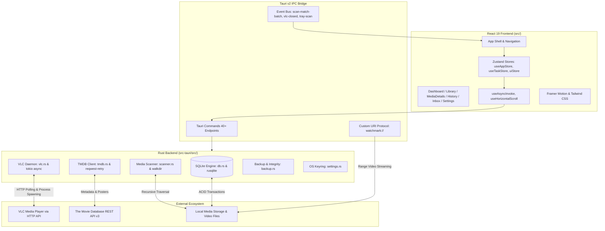

# WatchMark Media Tracker

<div align="center">

[](https://tauri.app/)
[](https://www.rust-lang.org/)
[](https://react.dev/)
[](https://www.typescriptlang.org/)
[](https://tailwindcss.com/)
[](https://www.sqlite.org/)
[](https://www.videolan.org/)
[](LICENSE)

**A fast, cinema-grade personal media tracking diary and local file player bridge.**

*Seamlessly bridge online TMDb metadata with your local media storage — with zero server bloat and automatic VLC playhead synchronization.*

[Motivation](#-motivation--why-i-built-this) • [Features](#-core-features) • [Architecture](#-architecture--tech-stack) • [Technical Challenges](#-technical-challenges--lessons-learned) • [Installation](#️-requirements--installation) • [Documentation](docs/README.md) • [Roadmap](ROADMAP.md) • [License](#-license)

</div>

---

## 💡 Motivation & Why I Built This

Like many movie and television fans, I love having a visually rich, poster-filled interface like Apple TV or Plex to browse my collection. But traditional home media servers come with serious trade-offs:
* They require **heavy background server daemons** running 24/7.
* They waste **high idle CPU and RAM** on forced transcoding and background telemetry.
* They require user accounts, complex network port forwarding, and constant maintenance.

At the same time, I already had the world's most versatile, lightweight media player installed on my laptop: **VLC Media Player**. It plays virtually every video codec, consumes negligible battery, and requires zero cloud configuration.

What was missing was the **bridge**—an application that gives you a beautiful streaming-style frontend, downloads official artwork and episode guides from The Movie Database (TMDb), and silently syncs your viewing progress with VLC in the background.

> **🎓 About This Project**  
> **WatchMark** was created as an independent **software engineering student capstone and portfolio project**. My goal was to explore low-level systems programming in **Rust**, modern native desktop windowing with **Tauri 2.0**, client-side ACID concurrency with **SQLite WAL**, and hardware compositor performance tuning in **React 19**.

---

## ✨ Core Features

### 🎬 Cinema-Grade Desktop Interface
* **Immersive Visual Aesthetics:** Deep dark palette (`#0D0F14`), translucent glassmorphism (`bg-[#1F222A]/60` with `backdrop-blur-md`), and signature VLC Orange accents (`#FF6B00`).
* **Edge-to-Edge Hero Banner:** 450px cinematic hero section with multi-stop diagonal gradient fades and an instant 1-click **Resume Watching** button.
* **"Continue Watching" Shelf:** Horizontal snap-scrolling row of wide episode cards with bottom-edge progress bars indicating your exact resume point.
* **DOM Virtualization (`VirtualPoster`):** High-performance `IntersectionObserver` windowing engine that unmounts off-screen poster elements, enabling smooth 60 FPS scrolling across 1,000+ media titles with low memory footprint.
* **Fluid Layout Transitions:** Hardware-accelerated view transitions and accordion springs powered by `framer-motion`, with built-in `prefers-reduced-motion` battery-saving support.

### 📡 Smart VLC Playhead Telemetry (Zero Background CPU)
* **100% Asynchronous Tracking:** Powered by `tokio::process::Command` and `tokio::select!` event loops that consume zero background CPU while watching.
* **Dynamic Loopback Port Probing:** Automatically detects free local ports between `8080` and `8090` to avoid socket collisions, generating a cryptographic one-time HTTP session password.
* **Exact-Second Playhead Resumption:** Remembers your exact playback position in seconds (`last_position`). Launching an episode resumes playback seamlessly using VLC's `--start-time` flag.
* **Intelligent Completion Thresholds:** Automatically marks episodes as completed and increments rewatch counts when you watch **≥ 90%** of the runtime or exit within **120 seconds** of the end credits.
* **Auto-Session Chaining & Isolation:**
  * Consecutive episodes watched within **6 hours** (< 21,600s) are linked into a single cohesive Binge Session UUID.
  * Switching to a different television series immediately terminates the chain and mints a fresh session ID.

### 📖 History Diary & Binge Timeline
* **Interactive BingeBlock Accordions:** Groups multi-episode binges into master-detail accordions displaying series titles, episode counts, total watch time, and fluid auto-height animations.
* **Midnight Crossover Detection:** Calculates UNIX epoch timestamps; if a viewing session crosses past midnight, a distinct `<Moon />` indicator is displayed alongside the duration badge.
* **Detailed Episode Breakdown:** Inspect individual watch timestamps, duration per episode, and pause frequency.

### 📁 High-Performance Media Scanner & Triage Inbox
* **Blazing-Fast Directory Traversal:** Recursively scans thousands of nested files in milliseconds using Rust's multi-threaded `walkdir` and multi-pattern regex matching (`S01E01`, `1x01`, `Ep 01`, etc.).
* **Windows Long Path & Shortcut Support:** Full compatibility with deep paths via Windows `\\?\` prefixing and automatic `.lnk` shortcut resolution via `parselnk`.
* **Chunked IPC Streaming:** Batches file scans in groups of 50 (`scan-match-batch`) to eliminate memory spikes and prevent UI lockups during massive library scans.
* **Persistent Triage Inbox:** Unmatched media files are grouped by extracted title into a dedicated staging UI for 1-click matching or manual linking.

### 🛡️ Local-First SQLite Engine & Data Safety
* **ACID Relational Storage:** Managed with `rusqlite` in Write-Ahead Logging mode (`PRAGMA journal_mode = WAL;`, `PRAGMA synchronous = NORMAL;`, `PRAGMA foreign_keys = ON;`).
* **Evolutionary Migration System:** Safe `ALTER TABLE` transactional migrations update database structures without data loss.
* **Atomic Backup & Restore:** In-app one-click database backups with SHA-256 checksum verification, automated 3-backup rolling retention, and safe restore routines.
* **Database Maintenance:** Built-in SQLite `VACUUM` and `PRAGMA optimize` tools to keep database queries instantaneous.
* **OS Keyring Integration:** Stores TMDB API keys securely in the Windows Credential Manager, macOS Keychain, or Linux Secret Service, with fallback support for `TMDB_API_KEY` environment variables.

---

## 🏗️ Architecture & Tech Stack



### Technology Matrix & Rationale

| Layer | Technology | Why This Choice? |
| :--- | :--- | :--- |
| **Desktop Shell** | **Tauri v2.10** | Replaced Electron to eliminate ~200MB of Chromium idle bloat; gives native OS windowing, custom protocols, and small executable sizes. |
| **Backend Core** | **Rust 2021 + Tokio** | Guarantees thread-safety and memory safety; Tokio provides asynchronous event loops for VLC HTTP polling without blocking the UI. |
| **Frontend UI** | **React 19 + TypeScript** | Strict end-to-end type safety between Rust IPC structs and frontend state; modern component lifecycle. |
| **Styling & Physics**| **Tailwind CSS + Framer Motion**| Utility-first dark cinema aesthetic with spring-based auto-height layout physics for accordions. |
| **Database** | **SQLite (rusqlite) + WAL** | Local-first ACID persistence; Write-Ahead Logging allows concurrent read operations while writes execute safely. |
| **State Management**| **Zustand 5** | Lightweight, boilerplate-free state management for reactive UI updates and task notifications. |
| **Security** | **OS Keyring (`keyring-rs`)** | Secure storage of API keys inside native OS credential vaults (Windows Credential Manager / macOS Keychain). |

---

## 🧠 Technical Challenges & Lessons Learned

As a student project, WatchMark was designed to tackle real engineering constraints:

### 1. Diagnosing a 70.3% GPU Compositor Bottleneck in WebView2
* **The Problem:** In initial builds, running the app on Windows with Cinema Mode enabled caused the WebView2 GPU Process to consume **70.3% GPU utilization** while sitting idle on the Dashboard.
* **The Root Cause:** Profiling revealed an infinite 30-second CSS Ken Burns scale animation (`[1, 1.15, 1]`) running on the 4K backdrop image in `SafeImage.tsx`. Because this image was scaling continuously behind elements with CSS `backdrop-filter: blur(...)` and gradient overlays, Chromium's compositor was forced to re-rasterize Gaussian blur convolution passes on every single frame refresh (144Hz).
* **The Fix:** Replaced the infinite scale loop with a hardware-accelerated static fade-in. Once loaded, the scale locks at `1.0`. Static high-contrast neon accents replaced infinite `animate-pulse` tags.
* **The Result:** **Idle GPU utilization dropped from 70.3% to 0.0% – 1.0%.**

### 2. Zero-CPU Subprocess Supervision
* **The Problem:** Polling VLC's HTTP interface using standard blocking loops or naive `std::thread::sleep` wastes CPU cycles and drains laptop battery.
* **The Solution:** Implemented an asynchronous child process supervisor in `vlc.rs` using `tokio::process::Command` and `tokio::select!`. WatchMark dynamically probes local ports (`8080..8090`) to avoid conflicts, generates a one-time cryptographic password, and polls VLC over non-blocking HTTP streams.
* **The Result:** **0.0% background CPU consumption** during media playback.

### 3. DOM Virtualization for 1,000+ Poster Collections
* **The Problem:** Rendering hundreds of high-resolution media posters with titles and hover states caused initial DOM mount lag and excessive RAM consumption.
* **The Solution:** Engineered `VirtualPoster.tsx` using the `IntersectionObserver` API. Poster elements outside the active viewport unmount their heavy DOM nodes and render lightweight placeholders until scrolled into view.
* **The Result:** Memory usage remains $<50\text{MB}$ across 1,000+ titles with constant 60 FPS scrolling.

### 4. Human-in-the-Loop AI Orchestration & Compiler Verification
* **The Methodology:** Developed the project using an autonomous AI pairing framework governed by an explicit Standard Operating Procedure ([`AGENTS.md`](AGENTS.md)). Rather than relying on fragile manual testing, every task was gated by **compiler-level static analysis** (`cargo check` and `tsc`). Rust's affine type system and TypeScript's strict mode served as deterministic verifiers against regressions.

---

## 🛠️ Requirements & Installation

### Prerequisites

| Dependency | Minimum Version | Required For |
| :--- | :--- | :--- |
| **Node.js** | `>= 20.0.0` (LTS) | React 19 Frontend & Vite 7 Bundler |
| **Rust & Cargo** | `>= 1.80.0` (2021 Edition) | Native Rust Backend & SQLite Concurrency |
| **VLC Media Player** | `>= 3.0.0` | Local Playhead Telemetry & Hardware Playback |
| **TMDB API Key** | v3 Developer Key | Metadata, Posters & Season Episode Details ([Free Account](https://www.themoviedb.org/settings/api)) |
| **C++ Build Tools** | MSVC (Windows) / GCC (Linux) | Native Desktop Windowing & SQLite Bindings |

---

### Step-by-Step Installation

#### 1. Clone the Repository
```bash
git clone https://github.com/Headhunte-121/timestampet.git
cd timestampet/watchmark-tauri
```

#### 2. Install Frontend Dependencies
```bash
npm install
```

#### 3. Run in Local Development Mode (with Hot Reload)
```bash
npm run tauri dev
```
* Vite starts on `http://127.0.0.1:1420`.
* The Rust backend initializes SQLite in WAL mode and opens the native WatchMark window.
* Diagnostic logs are piped to stdout and written to `%LOCALAPPDATA%\WatchMark\watchmark.log`.

---

### 📦 Compiling a Standalone Production Executable

To compile a fully optimized, standalone desktop release with Link-Time Optimization (LTO):

```bash
cd watchmark-tauri
npm run tauri build
```

The compiled release packages are output to:
* **Windows:** `watchmark-tauri/src-tauri/target/release/watchmark-tauri.exe` (and NSIS installer in `bundle/nsis/`)
* **macOS:** `watchmark-tauri/src-tauri/target/release/bundle/macos/WatchMark.app` (and `.dmg`)
* **Linux:** `watchmark-tauri/src-tauri/target/release/bundle/deb/` (and `.AppImage`)

---

## 🚀 Quick Walkthrough

1. **Initial Setup:** Open **Settings (⚙️)** $\rightarrow$ enter your **TMDb API Key** $\rightarrow$ verify your **VLC Path** (auto-detected).
2. **Add Shows & Movies:** Click **Search (🔍)** $\rightarrow$ search any title (e.g. *Severance* or *Dune*) $\rightarrow$ click **+ Add to Tracker**. Metadata, seasons, and posters are saved to your local database.
3. **Scan Local Media:** Go to the **Inbox** tab $\rightarrow$ click **Scan Directory** (or `Ctrl+Shift+S`) $\rightarrow$ select your media folder. WatchMark parses season/episode numbers and links matching video files.
4. **Resolve Unmatched Files:** Any oddly-named files appear in the **Inbox** grouped by parsed title. Click **Assign to Existing Show** to link them with 1 click.
5. **Watch & Track:** Click **▶ Play** on any episode. WatchMark launches VLC at your exact resume position. When you exit, your progress, completion ratio, and binge history update automatically!

---

## 🗺️ Project Status & Roadmap

WatchMark uses native **GitHub Milestones and Issues** to track upcoming features:

| Version | Focus Area | Status |
| :--- | :--- | :--- |
| **v1.0.0** | Core Architecture, SQLite WAL & VLC Telemetry | ✅ Completed |
| **v1.1.0** | Filesystem Scanner, Triage Inbox & OS Keyring | ✅ Completed |
| **v1.2.0** | Spotlight Recommendation, Timeline Virtualization & GPU Fix | 🚀 Current Stable |
| **v1.3.0** | Library Intelligence, Multi-Filtering & Deep Cast/Crew Metadata | 🔨 In Active Development |
| **v1.4.0** | VLC Audio/Subtitle Track Switcher & Background Tray Daemon | 📋 Planned |
| **v1.5.0** | Viewing Analytics Dashboard & Trakt/Letterboxd Data Portability | 📋 Planned |
| **v2.0.0** | Ambient Chromatic Cinema UI & Universal Command Palette (`Ctrl+K`) | 🔮 Future |

For detailed breakdowns, see [**ROADMAP.md**](ROADMAP.md) and the [**GitHub Milestones**](https://github.com/Headhunte-121/timestampet/milestones).

---

## 🤝 Contributing & Feedback

Contributions, feedback, and suggestions from fellow students and developers are warmly welcomed!
* Found a bug? Open a [Bug Report](.github/ISSUE_TEMPLATE/bug_report.md).
* Have an idea? Submit a [Feature Request](.github/ISSUE_TEMPLATE/feature_request.md).
* Want to contribute code? Check out [**CONTRIBUTING.md**](CONTRIBUTING.md) for PR guidelines and architectural standards.

---

## ⚖️ Legal & DMCA Compliance Statement

**WatchMark is strictly a personal, client-side media cataloging diary and offline library manager.**
* **No Content Hosting, Streaming, or Distribution:** WatchMark does not host, provide, stream, download, scrape, or distribute any copyrighted video, audio, or media files.
* **User-Owned Media Files Only:** The application operates exclusively as a local metadata viewer and organizer for legally acquired, user-owned media files residing on the user's personal storage devices.
* **Official API Compliance:** All show, movie, and episode metadata and artwork are retrieved strictly via the official [The Movie Database (TMDb) API](https://www.themoviedb.org/documentation/api) in full compliance with TMDb's API Terms of Service. This product uses the TMDb API but is not endorsed or certified by TMDb.
* **Zero Third-Party Scraping or Piracy Mechanisms:** WatchMark does not contain any web-scraping utilities, torrent protocols, peer-to-peer distribution networks, bypass modules, or circumvention tools.

---

## 📜 License & Acknowledgments

This project is open-source software licensed under the **MIT License** — see the [LICENSE](LICENSE) file for details.

### Acknowledgments
* **[VideoLAN (VLC)](https://www.videolan.org/):** For building the world's most versatile, open-source media player.
* **[The Movie Database (TMDb)](https://www.themoviedb.org/):** For their generous, developer-friendly metadata API.
* **[Tauri Project](https://tauri.app/):** For making lightweight, memory-safe desktop application development in Rust a reality.

---

<div align="center">
  <sub>Built with ❤️ as an open-source student engineering project using Tauri 2.0, Rust, React, and VLC.</sub>
</div>
