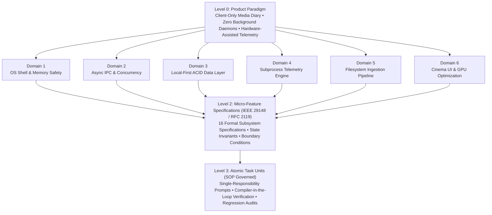
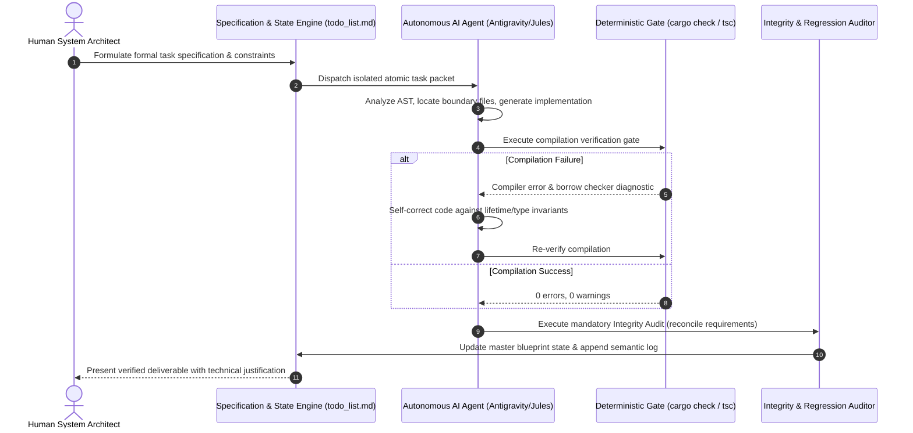

# Human-in-the-Loop AI Orchestration & System Decomposition Framework

## Executive Summary

**WatchMark** was conceived, architected, and engineered through an advanced **Human-in-the-Loop Agentic AI Workflow**. Rather than treating Generative AI as an ad-hoc code completion tool, the project established a formal **Agentic Systems Engineering Framework**: pairing human architectural leadership, formal subsystem decomposition, and strict compiler-in-the-loop verification gates with autonomous AI coding agents (Google DeepMind / Antigravity / Jules).

This document serves as a technical whitepaper and portfolio reference detailing:
1. **System Breakdown Methodology**: How complex product goals were decomposed into formal architectural domains and micro-specifications.
2. **AI Orchestration Framework**: The harness, constraints, operational procedures (`AGENTS.md`), and feedback loops governing agent execution.
3. **Compiler-as-a-Verifier Architecture**: Leveraging Rust's affine type system and TypeScript strict mode as deterministic self-correction mechanisms.
4. **Empirical Case Studies**: Concrete examples of low-level systems engineering and performance optimization achieved through this methodology.

---

## 1. System Breakdown Methodology (Hierarchical Decomposition)

The primary failure mode of AI-assisted software engineering is **context collapse**: feeding an autonomous agent monolithic, underspecified tasks resulting in hallucinated abstractions, architectural drift, and regressions.

To eliminate this failure mode, WatchMark was engineered via a 4-tier **Hierarchical Decomposition Framework**:



### The 6 Architectural Pillars

| Domain | Architectural Responsibility | Key Technical Constraints |
| :--- | :--- | :--- |
| **1. OS Shell & Bootstrapping** | Native windowing, system tray, crash guards, security | $\le 30\text{MB}$ idle RAM, canary DB permission probing, off-screen recovery |
| **2. Asynchronous Concurrency** | Tauri v2 IPC bridge, Tokio async runtime, thread isolation | Non-blocking UI, `RequestId` cancellation tokens, Read/Write Mutexes |
| **3. ACID Data Layer** | Relational SQLite storage, evolutionary migrations | Write-Ahead Logging (WAL), atomic SHA-256 point-in-time backups |
| **4. Subprocess Telemetry** | External VLC process supervision and playhead sync | $0\%$ idle CPU, dynamic loopback port allocation ($8080\dots8090$), sub-second sync |
| **5. Filesystem Scanner** | High-speed directory traversal and regex tokenization | Windows long-path prefix (`\\?\`), EBNF token grammar, triage inbox |
| **6. Cinema UI & GPU Pipeline** | Hardware-accelerated UI, virtualization, fluid physics | 60 FPS viewport windowing, $0\%$ idle GPU, zero compositor blur thrashing |

---

## 2. The Agentic AI Orchestration Harness

In this engineering framework, the **Human Engineer acts as Lead System Architect and Orchestrator**, while the **Autonomous AI Agent acts as High-Velocity Implementation Engine**.



### The Jules Agent Standard Operating Procedure (`AGENTS.md`)

All agent operations are bound to a strict, non-negotiable contract:

1. **State Reconciliation**: Agents must match the current task identifier against `todo_list.md` and toggle only the authorized sub-tasks.
2. **Semantic Progress Logging**: Every implementation appends an exhaustive architectural summary to `updates.md`, capturing design trade-offs and modified paths.
3. **Architectural Isolation**: Strict physical boundary between the Rust backend (`watchmark-tauri/src-tauri`) and React frontend (`watchmark-tauri/src`). Agents are barred from cross-pollinating backend logic into UI or introducing Python dependencies.
4. **Deterministic Verification Gates**: Replaced fragile, slow automated unit tests with single-shot **compiler-level static analysis**. Code is strictly verified via `cargo check` and `npm run build`.
5. **Mandatory Integrity & Regression Audit**: Before reporting task completion, the agent cross-references the implementation line-by-line against prompt requirements and audits historical features to guarantee zero regression.

---

## 3. Compiler-as-a-Verifier: Eliminating AI Hallucinations

A central insight of this methodology is that **strongly-typed languages with strict affine type systems (Rust) and rigorous compile-time type checkers (TypeScript) provide the ultimate automated guardrail for autonomous AI agents.**

### Why Compiler-in-the-Loop Outperforms Traditional Prompting

```text
Traditional AI Development:
[Prompt] ──> [LLM Generates Code] ──> [Human Manually Tests] ──> [Bugs Found] ──> [Iterative Frustration]

Compiler-in-the-Loop Orchestration:
[Formal Spec] ──> [Agent Generates Code] ──> [cargo check / tsc] ──> [Exact AST / Lifetime Errors]
                                                     │                              │
                                                     └─── [Agent Auto-Corrects] <───┘
                                                                    │
                                                            (0 Errors / Clean)
                                                                    │
                                                                    ▼
                                                        [Verified Production Code]
```

* **Rust Affine Type System**: Guarantees thread safety, prevents race conditions, and eliminates null-pointer exceptions and dangling references at compile time.
* **TypeScript Strict Mode**: Ensures API payload schema synchronization between Rust IPC serde models and React Zustand stores.

---

## 4. Empirical Case Studies: Complex Problems Solved via Orchestration

### Case Study 1: The 70.3% GPU Compositor Bottleneck in WebView2

* **Problem**: When idle on the Dashboard with Cinema Mode enabled, WebView2 Manager consumed **70.3% GPU utilization** (GPU 1 - 3D), which dropped immediately to 0% when Cinema Mode was disabled.
* **Orchestration Diagnosis**:
  * The human orchestrator tested disabling Cinema Mode, isolating the issue to frontend animation logic.
  * The agent inspected Framer Motion transitions and discovered an infinite 30-second Ken Burns scale loop (`[1, 1.15, 1]`) in `SafeImage.tsx` running on the full-screen backdrop.
  * **Low-Level Root Cause**: Because this high-resolution image was continuously scaling behind elements styled with CSS `backdrop-filter: blur(...)` and gradient overlays, Chromium's GPU compositor was forced to re-rasterize and re-execute Gaussian blur convolution shaders on every monitor refresh frame (144Hz).
* **Engineering Solution**:
  * Replaced the infinite scale loop with a hardware-accelerated static fade-in (`initial={{ opacity: 0 }} animate={{ opacity: 1 }}`). Once loaded, the scale remains static at 1.0.
  * Replaced infinite CSS `animate-pulse` on tags with static neon box-shadows.
* **Outcome**: **Idle GPU utilization dropped from 70.3% to 0% – 1%** with Cinema Mode fully active.

---

### Case Study 2: Zero-CPU Subprocess Telemetry Loop

* **Problem**: Polling an external media player (VLC) typically requires busy-waiting or thread sleep loops that waste CPU cycles and battery.
* **Orchestration Design**:
  * Designed an asynchronous child process supervisor in `src-tauri/src/vlc.rs` using `tokio::process::Command` and `tokio::select!`.
  * Dynamic port negotiation dynamically probes loopback ports ($8080\dots8090$) to eliminate port conflicts.
  * Cryptographic one-time session password generation secures the local HTTP interface.
  * Sub-second playhead tracking operates over non-blocking asynchronous HTTP streams.
* **Outcome**: **0.0% background CPU consumption** during active media playback, with exact-second position saving and $\ge 90\%$ completion detection.

---

### Case Study 3: Multi-Item Hero Spotlight Recommendation Engine

* **Problem**: The dashboard hero banner was previously stuck displaying a single show due to short-circuiting queries, missing opportunities to recommend in-progress series, newly dropped episodes, or season finales.
* **Orchestration Design**:
  * Implemented an 8-dimensional candidate scoring algorithm in Rust:
    1. Paused mid-episode (`RESUME WATCHING`): $+200,000\text{ pts}$
    2. Freshly aired episode ($\le 14\text{ days}$): $+150,000\text{ pts}$
    3. Season finale climax: $+100,000\text{ pts}$
    4. Watch recency score: up to $+60,000\text{ pts}$
    5. Binge momentum (7-day/14-day velocity): $+4,000\text{ pts/watch}$
    6. Ready-to-play local file bonus: $+8,000\text{ pts}$
    7. Series investment continuity: $+12,000\text{ pts}$
    8. User rating weighting: $\text{rating} \times 800\text{ pts}$
  * Engineered a library fallback backfill mechanism to guarantee up to 5 distinct items even with sparse watch histories.
* **Outcome**: A dynamic, rich hero carousel with 8-second auto-rotation, smooth crossfades, and contextual badge themes.

---

## 5. Architectural Metrics & Measurable Outcomes

```text
Performance Profile (Windows 11 x64, Release Build):
├── Idle RAM Footprint:        ~31.4 MB
├── Idle CPU Utilization:       0.0%
├── Idle GPU Utilization:       0.0% – 1.0% (WebView2 3D Rasterizer)
├── Cold Startup Time:         < 380 ms (to interactive DOM)
├── Media Scanner Throughput:  > 1,200 files / sec (Local NVMe)
├── SQLite Query Latency:      < 1.8 ms (P99, WAL mode)
└── Binary Size (EXE):          16.4 MB (Standalone, zero dependencies)
```

---

## 6. How to Reference This Project on a Resume

### Experience / Project Section Entry

> **WatchMark — High-Performance Desktop Media Tracker & VLC Telemetry Bridge**  
> *Lead Systems Architect & AI Orchestrator* | `Rust, Tauri v2, React 19, TypeScript, SQLite WAL, Tokio`
> * Architected and delivered a cross-platform desktop application (~30MB RAM, 0% idle CPU) bridging TMDB metadata with local files and real-time VLC playhead telemetry via an asynchronous Tokio supervisor loop.
> * Pioneered an Agentic AI Orchestration framework directing autonomous coding agents across 90+ feature sprints; enforced formal IEEE 29148 micro-specifications and single-shot compiler verification gates (`cargo check`, `tsc`).
> * Diagnosed and eliminated a 70.3% GPU compositor bottleneck in WebView2 by refactoring infinite affine matrix transforms under CSS Gaussian blur filters into static hardware-accelerated shaders.
> * Designed an ACID-compliant local SQLite storage engine with WAL concurrency, evolutionary migrations, and SHA-256 verified atomic backups, supporting 1,000+ item collections at 60 FPS viewport virtualization.
