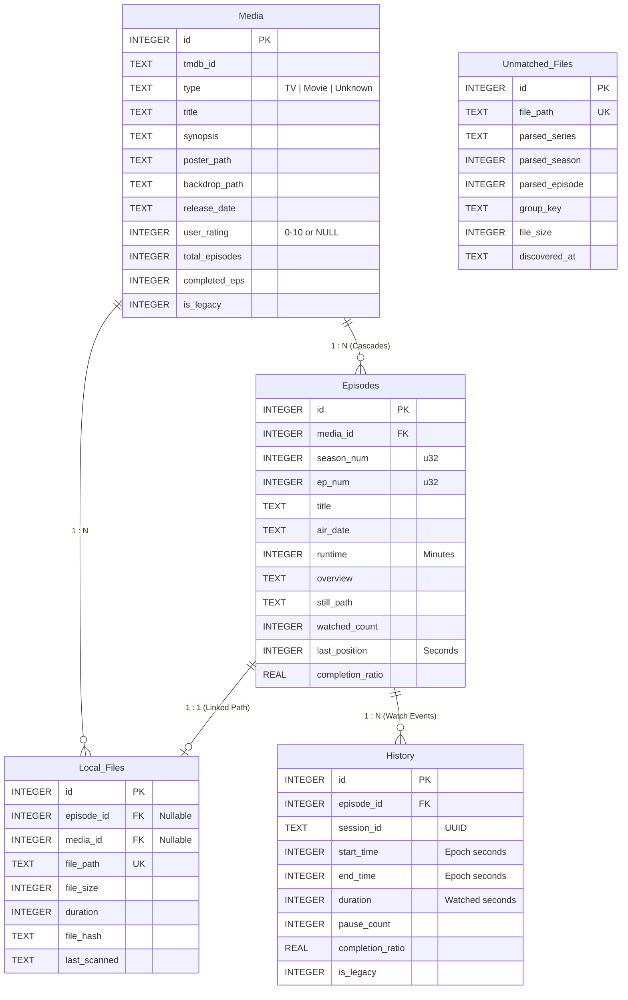

# Database Schema & Storage Architecture

This document specifies the SQLite relational database architecture of **WatchMark**, detailing table structures, indexes, integrity constraints, and transactional migration lifecycles.

---

## 🗄️ Relational Data Model

WatchMark uses **SQLite** through the `rusqlite` crate, configured with foreign key cascades and Write-Ahead Logging.



---

## 📋 Table Definitions & Constraints

### 1. `Media` Table
Represents a TV Show or Movie in the user's library.

```sql
CREATE TABLE IF NOT EXISTS Media (
    id INTEGER PRIMARY KEY AUTOINCREMENT,
    tmdb_id TEXT NOT NULL,
    "type" TEXT NOT NULL DEFAULT 'TV',
    "title" TEXT NOT NULL,
    synopsis TEXT,
    poster_path TEXT,
    backdrop_path TEXT,
    release_date TEXT DEFAULT '0000-00-00',
    user_rating INTEGER CHECK(user_rating >= 0 AND user_rating <= 10) DEFAULT NULL,
    status TEXT DEFAULT 'Tracking',
    total_episodes INTEGER DEFAULT 0,
    completed_eps INTEGER DEFAULT 0,
    is_legacy INTEGER DEFAULT 0,
    created_at DATETIME DEFAULT CURRENT_TIMESTAMP,
    updated_at DATETIME DEFAULT CURRENT_TIMESTAMP,
    UNIQUE(tmdb_id, "type")
);
```
* **Composite Uniqueness**: `UNIQUE(tmdb_id, "type")` ensures that a Movie and TV Show sharing the same TMDB numerical ID can coexist without collisions.
* **Rating Boundaries**: `CHECK(user_rating >= 0 AND user_rating <= 10)` enforces strict rating parameters while allowing `NULL` for unrated media.

---

### 2. `Episodes` Table
Represents individual episodes belonging to a TV show, or single records for movies.

```sql
CREATE TABLE IF NOT EXISTS Episodes (
    id INTEGER PRIMARY KEY AUTOINCREMENT,
    media_id INTEGER NOT NULL,
    season_num INTEGER NOT NULL CHECK(season_num >= 0),
    ep_num INTEGER NOT NULL CHECK(ep_num >= 0),
    title TEXT,
    air_date TEXT,
    runtime INTEGER DEFAULT 0,
    overview TEXT,
    still_path TEXT,
    watched_count INTEGER DEFAULT 0,
    last_position INTEGER DEFAULT 0,
    completion_ratio REAL DEFAULT 0.0,
    FOREIGN KEY(media_id) REFERENCES Media(id) ON DELETE CASCADE,
    UNIQUE(media_id, season_num, ep_num)
);
```
* **Cascading Cleanup**: `FOREIGN KEY(media_id) REFERENCES Media(id) ON DELETE CASCADE` guarantees that deleting a show atomically deletes all associated episodes.
* **Positive Integers**: `CHECK(season_num >= 0)` and `CHECK(ep_num >= 0)` prevent negative integer corruptions, treating Season `0` as specials.

---

### 3. `History` Table
Represents discrete watch events, playhead sessions, and binge chaining.

```sql
CREATE TABLE IF NOT EXISTS History (
    id INTEGER PRIMARY KEY AUTOINCREMENT,
    episode_id INTEGER NOT NULL,
    session_id TEXT NOT NULL,
    start_time INTEGER NOT NULL,
    end_time INTEGER NOT NULL,
    duration INTEGER DEFAULT 0,
    pause_count INTEGER DEFAULT 0,
    completion_ratio REAL DEFAULT 0.0,
    is_legacy INTEGER DEFAULT 0,
    created_at DATETIME DEFAULT CURRENT_TIMESTAMP,
    FOREIGN KEY(episode_id) REFERENCES Episodes(id) ON DELETE CASCADE
);
```
* **Epoch Timestamps**: Stored as 64-bit integer UNIX epochs (`start_time`, `end_time`) for timezone-independent calculations and Midnight Crossover detection.

---

### 4. `Local_Files` Table
Represents discovered video files on disk linked to library media.

```sql
CREATE TABLE IF NOT EXISTS Local_Files (
    id INTEGER PRIMARY KEY AUTOINCREMENT,
    episode_id INTEGER,
    media_id INTEGER,
    file_path TEXT NOT NULL UNIQUE,
    file_size INTEGER,
    duration INTEGER,
    file_hash TEXT,
    last_scanned DATETIME DEFAULT CURRENT_TIMESTAMP,
    FOREIGN KEY(episode_id) REFERENCES Episodes(id) ON DELETE SET NULL,
    FOREIGN KEY(media_id) REFERENCES Media(id) ON DELETE CASCADE
);
```

---

### 5. `Unmatched_Files` Table
Persistent triage queue for media files discovered during recursive directory scans that could not be automatically matched.

```sql
CREATE TABLE IF NOT EXISTS Unmatched_Files (
    id INTEGER PRIMARY KEY AUTOINCREMENT,
    file_path TEXT NOT NULL UNIQUE,
    parsed_series TEXT,
    parsed_season INTEGER,
    parsed_episode INTEGER,
    group_key TEXT,
    file_size INTEGER,
    discovered_at DATETIME DEFAULT CURRENT_TIMESTAMP
);
```

---

## ⚙️ SQLite PRAGMA Configuration

WatchMark tunes SQLite for high concurrency, low latency, and zero data corruption:

```rust
// Executed on every database connection
conn.pragma_update(None, "journal_mode", "WAL")?;
conn.pragma_update(None, "synchronous", "NORMAL")?;
conn.pragma_update(None, "foreign_keys", "ON")?;
conn.pragma_update(None, "cache_size", -2000)?; // 2MB cache
conn.pragma_update(None, "temp_store", "MEMORY")?;
```

* **Write-Ahead Logging (WAL)**: Allows background file scans to write records concurrently while the React UI reads library and dashboard metrics, preventing database lock exceptions.
* **Safe PRAGMA Execution**: Uses `conn.pragma_update` rather than `conn.execute` to safely swallow return rows without triggering rusqlite panic conditions.

---

## 🔄 Evolutionary Transactional Migrations

To ensure users never lose historical watch counts or ratings when upgrading versions, WatchMark utilizes an evolutionary migration system based on `PRAGMA user_version`:

```rust
pub fn run_migrations(conn: &mut Connection) -> Result<(), AppError> {
    let current_version: i32 = conn.query_row("PRAGMA user_version;", [], |r| r.get(0))?;
    
    // Migrations wrapped in atomic transactions
    if current_version < 1 {
        let tx = conn.transaction()?;
        // Safe ALTER TABLE executions
        tx.pragma_update(None, "user_version", 1)?;
        tx.commit()?;
    }
    // Successive migrations...
    Ok(())
}
```

* **Atomic Transactions**: If the application crashes mid-migration, the database rolls back cleanly.
* **Safe Column Additions**: Column additions use conditional checks or safely catch duplicate column errors, preventing migration deadlocks.

---

## 🛡️ Atomic Database Backups & Verification

Located in `src-tauri/src/backup.rs`:
* **Online SQLite Backup API**: Backups are created using SQLite's native backup API, capturing consistent snapshots even while the database is actively being read.
* **SHA-256 Checksums**: Every backup file generates an accompanying `.sha256` checksum file to guarantee data integrity before restoring.
* **Automatic Rotation**: Keeps a rolling window of recent backups in `%LOCALAPPDATA%\WatchMark\backups\`, pruning older archives.
