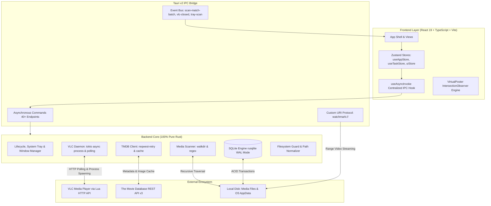
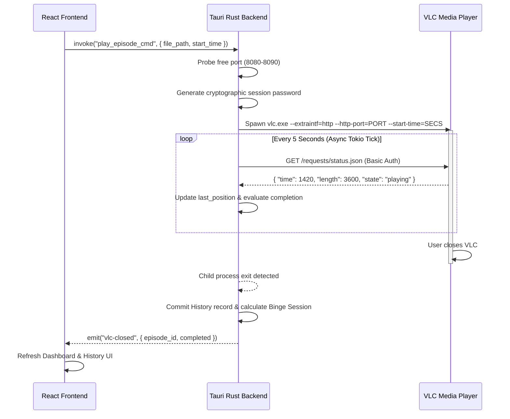

# System Design & Architecture

This document provides a comprehensive technical overview of the **WatchMark Media Tracker** architecture, detailing its inter-process communication (IPC) model, asynchronous execution loop, VLC telemetry protocol, and security boundaries.

---

## 🏛️ High-Level System Topology

WatchMark is built on **Tauri v2**, uniting a high-performance **Rust backend** with a cinema-grade **React 19 + Tailwind CSS** frontend:



---

## ⚡ Asynchronous Execution & Zero Background CPU

A core architectural principle of WatchMark is **zero background CPU usage when idle**. Traditional desktop media trackers often suffer from CPU spikes caused by busy-spin polling or heavy Node.js runtimes.

WatchMark achieves zero background CPU via Rust’s `tokio` asynchronous runtime:

```rust
// Simplified representation from src-tauri/src/vlc.rs
tokio::select! {
    // 1. Await child process exit without blocking the thread
    status = child.wait() => {
        tracing::info!("[VLC] Process exited with status: {:?}", status);
        break;
    }
    // 2. Poll the HTTP telemetry interface at exact 5-second intervals
    _ = interval.tick() => {
        poll_vlc_telemetry(&client, port, &password, ...).await;
    }
}
```

* **Non-Blocking Process Handling**: The VLC child process handle is managed via `tokio::process::Child`. It is awaited asynchronously without consuming worker threads.
* **Interval Sleeping**: Between 5-second telemetry ticks, the background polling task yields entirely to the Tokio executor, dropping CPU consumption to 0.0%.

---

## 📡 The VLC Telemetry & Playhead Protocol

Rather than embedding a bloated, proprietary video player inside the desktop app, WatchMark delegates playback to the user's native **VLC Media Player**, connecting to VLC's built-in Lua HTTP interface in the background.



### 1. Dynamic Port Discovery & Secure Auth
* **Collision-Free Socket Probing**: On each playback invocation, the backend probes ports sequentially from `8080` to `8090` using `std::net::TcpListener::bind`. The first free port is selected dynamically, preventing collisions with other local software.
* **Cryptographic Passwords**: Generates a random 16-character alphanumeric password using `rand::thread_rng` on every launch, ensuring unauthorized local applications cannot manipulate VLC.

### 2. High-Precision Resumption
* Playhead position is tracked in absolute seconds (`last_position`).
* Launching an episode passes `--start-time=<seconds>` directly to VLC, instantly restoring playback where the user left off.

### 3. Intelligent Completion Thresholds
* **≥ 90% Rule**: If the ratio `(current_time / total_length) >= 0.90`, WatchMark flags the episode as **Completed** (`completion_ratio = 1.0`) and increments `watched_count`.
* **120-Second Credit Margin**: If the user closes VLC within 120 seconds of the credits (`total_length - current_time <= 120`), it is also automatically marked as completed.

### 4. Auto-Session Chaining & Isolation
* **Strict 6-Hour Boundary**: Consecutive episodes watched within **6 hours** (< 21,600s) are automatically linked under the same `session_id` UUID.
* **Show Isolation**: If the user finishes an episode of *Show A* and opens an episode of *Show B*, the backend immediately isolates the session and mints a brand-new `session_id`.

---

## 🔒 Security Architecture & Custom Protocols

### 1. Custom URI Protocol (`watchmark://`)
To allow the React frontend to display video frames, stream local clips, and resolve local posters without triggering WebView cross-origin security restrictions, WatchMark registers an asynchronous URI protocol:
* **Percent-Decoding**: Accurately decodes URL-encoded paths (e.g. spaces, special characters).
* **HTTP Range Support**: Implements HTTP Range headers (`bytes=start-end`), enabling video seeking without buffering entire media files into memory.

### 2. Path Traversal & Sanitization (`filesystem_guard.rs`)
* All paths supplied to backend commands undergo canonicalization and boundary checks via `filesystem_guard.rs`.
* Traversal tokens (`..`, null bytes) are rejected, preventing arbitrary filesystem access.
* Windows Long Path prefixing (`\\?\`) is handled natively to support file trees exceeding the 260-character Windows MAX_PATH limitation.

---

## 🚀 Frontend Virtualization & Performance

### `VirtualPoster` IntersectionObserver Windowing
Rendering hundreds of high-resolution posters in a standard React DOM causes severe memory bloat and scroll stuttering. WatchMark solves this via the custom `VirtualPoster` component:
* An `IntersectionObserver` monitors poster visibility.
* Off-screen posters are completely unmounted from the DOM and replaced by lightweight placeholder `div` blocks of exact aspect ratio (2:3).
* DOM nodes and image memory caches are purged immediately, allowing libraries of 1,000+ shows to scroll at a locked 60 FPS while keeping memory under 50MB.
