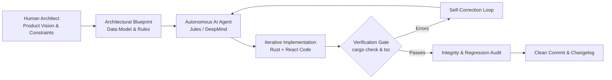

# AI-Assisted Architecture & Engineering Workflow

This document explains the **Human-in-the-Loop Agentic AI Workflow** utilized to design, build, and verify the **WatchMark Media Tracker** codebase.

---

## 🤖 Philosophy: Human Leadership + Autonomous Agentic Speed

WatchMark was engineered through a disciplined collaboration between human system architects and autonomous AI coding agents (Google DeepMind / Jules / Antigravity).

Rather than treating AI as an ad-hoc snippet generator, the project treated the AI agent as a **high-velocity systems engineer** operating under strict architectural boundaries, explicit Standard Operating Procedures (SOPs), and automated verification gates.

---

## 📜 The Jules Agent Standard Operating Procedure (`AGENTS.md`)

All autonomous coding agents interacting with this repository are governed by the mandatory guidelines defined in [`AGENTS.md`](file:///c:/OSINT/Tools/timestampet/AGENTS.md). 

Every feature, refactor, or bug fix must complete the following 5-phase routine before being finalized:

### 1. Master To-Do Reconciliation
* Locate the specific task identifier in the master blueprint.
* Mark only the completed sub-tasks as done.
* Prevent unauthorized modification of unrelated task states.

### 2. Progress Logging & Semantic Changelogs
* Document all changes in the project changelog.
* Record specific architectural updates, modified files, and non-obvious design choices.

### 3. Strict Directory Boundaries
* **Pure Rust Backend**: All Rust code, database schemas, and Cargo dependencies strictly reside within `watchmark-tauri/src-tauri/`.
* **React Frontend**: All UI components, Tailwind styling, and React hooks reside within `watchmark-tauri/src/`.

### 4. Zero-Tolerance Verification Gates
* Automated test suites that slow down iteration or write brittle mock files are forbidden.
* Instead, verification relies on **compiler-level static analysis**:
  - `cargo check`: Verifies 100% of the Rust codebase for lifetime, borrowing, type, and syntax integrity.
  - `npx tsc --noEmit`: Verifies 100% of the TypeScript codebase for strict interface conformance.
* Code that fails compilation is rejected and must be self-corrected immediately.

### 5. Mandatory Integrity & Regression Audits
Before finalizing any task, the agent must perform a line-by-line cross-reference against the prompt:
* Cross-reference explicit requirements and edge-case behaviors.
* Audit for regression: ensure refactored functions carry over all previously established capabilities.
* Enforce project conventions (e.g. `useAsyncInvoke` for IPC, `AppError` for Rust errors).
* Clean up any temporary scratch or mock files before submission.

---

## 🏆 Key Benefits Demonstrated in WatchMark

1. **Velocity Without Technical Debt**: The project completed over 90 complex feature implementations (including Tokio async child processes, SQLite WAL migrations, and Framer Motion layout physics) in record time without compromising type-safety.
2. **Deterministic Quality**: By coupling AI implementation loops with strict compiler verification gates (`cargo check`), runtime panics and type mismatches were eliminated before landing in the branch.
3. **Transparent Methodology**: By formalizing the AI pairing process in `AGENTS.md` and `AI_WORKFLOWS.md`, the repository serves as an open blueprint for how professional software teams can effectively partner with autonomous AI agents.
