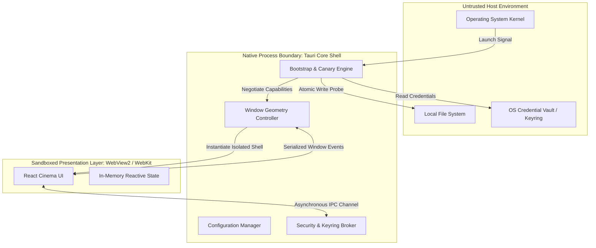
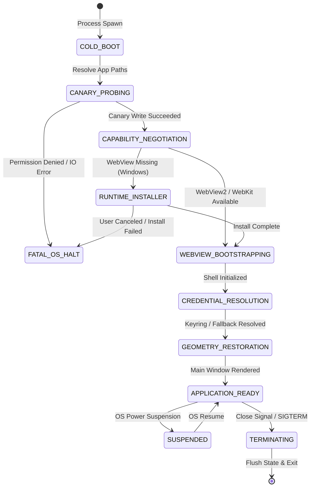

# Specification 01: Core Shell, Lifecycle & OS Boundaries

This specification defines the system lifecycle, platform isolation boundaries, operating system directory resolution, storage security model, and window geometry restoration protocols for **WatchMark Media Tracker**.

---

## 📑 Table of Contents
1. [System Scope, Architecture & Boundary Placement](#1-system-scope-architecture--boundary-placement)
2. [Normative Requirements](#2-normative-requirements)
3. [Data Models, Entities & System Invariants](#3-data-models-entities--system-invariants)
4. [Algorithmic Specifications & Mathematical Models](#4-algorithmic-specifications--mathematical-models)
5. [State Machines & Lifecycle Transitions](#5-state-machines--lifecycle-transitions)
6. [Interface Contracts & IPC Wire Protocols](#6-interface-contracts--ipc-wire-protocols)
7. [Security Architecture & Threat Modeling](#7-security-architecture--threat-modeling)
8. [Failure Modes, Resilience & Graceful Degradation Matrix](#8-failure-modes-resilience--graceful-degradation-matrix)

---

## 1. System Scope, Architecture & Boundary Placement

### 1.1 Scope & Purpose
The **Core Shell and Storage Subsystem** governs application initialization, security boundary enforcement between untrusted UI runtimes and native operating system privileges, operating system credential management, and persistent shell configuration.



### 1.2 Non-Goals
* This subsystem **MUST NOT** perform remote network operations or cloud profile synchronization.
* This subsystem **MUST NOT** parse media stream contents or execute video decoding logic.
* This subsystem **MUST NOT** permit direct filesystem access or un-sanitized path execution from the presentation runtime.

---

## 2. Normative Requirements

The key words **MUST**, **MUST NOT**, **REQUIRED**, **SHALL**, **SHALL NOT**, **SHOULD**, **SHOULD NOT**, **RECOMMENDED**, **MAY**, and **OPTIONAL** in this document are to be interpreted as described in [RFC 2119](https://datatracker.ietf.org/doc/html/rfc2119).

### 2.1 Functional Requirements (`FR`)
* **FR-01-01 (Canary Probe)**: Before initializing the presentation layer, the core shell **MUST** execute a canary write probe against the target local application directory.
* **FR-01-02 (Native Error Interception)**: If the canary write probe encounters an I/O or permissions failure, the core shell **MUST** display a native operating system message dialog and terminate gracefully before loading the webview runtime.
* **FR-01-03 (Credential Isolation)**: Secret credentials (e.g., TMDB API tokens) **MUST** be stored in the native operating system credential store (Windows Credential Manager, macOS Keychain, or Linux Secret Service via FreeDesktop DBus).
* **FR-01-04 (Credential Fallback)**: If native credential services are disabled or unavailable, credentials **MUST** fall back to process environment variables (`TMDB_API_KEY`) or an obfuscated application storage profile, with warning telemetries emitted.
* **FR-01-05 (Defensive Deserialization)**: Corrupted, malformed, or version-mismatched settings files **MUST NOT** induce panic crashes; the shell **MUST** repair the settings file to canonical defaults while preserving salvageable properties.
* **FR-01-06 (Window State Persistence)**: Window coordinates ($X, Y$) and dimensions ($W, H$) **MUST** be saved during session closure and restored on boot.

### 2.2 Non-Functional Requirements (`NFR`)
* **NFR-01-01 (Startup Overhead)**: Core shell bootstrapping and canary verification **MUST** execute in $\le 30\text{ ms}$ on standard SSD hardware.
* **NFR-01-02 (Memory Footprint)**: Core shell initialization overhead (excluding WebView2 browser process) **MUST** remain below $15\text{ MB}$ RSS.
* **NFR-01-03 (Process Boundary Safety)**: Zero unvalidated string parameters passed over IPC may be converted directly into shell execution calls.

---

## 3. Data Models, Entities & System Invariants

### 3.1 Directory Topology Specifications
All application data structures **MUST** reside within standard operating system user profile directories, segregated by purpose:

| Directory Type | Platform | Canonical Path Definition | Access Mode |
| :--- | :--- | :--- | :--- |
| **Configuration** | Windows | `%APPDATA%\com.WatchMark.WatchMark\settings.json` | Read / Write |
| **Local Database** | Windows | `%LOCALAPPDATA%\WatchMark\watchmark.db` | Read / Write / Lock |
| **Image Cache** | Windows | `%LOCALAPPDATA%\WatchMark\cache\{posters,backdrops}\` | Read / Write / Purge |
| **Backups** | Windows | `%LOCALAPPDATA%\WatchMark\backups\` | Read / Write |
| **Runtime Logs** | Windows | `%LOCALAPPDATA%\WatchMark\logs\` | Append-Only |
| **Configuration** | Linux | `$XDG_CONFIG_HOME/watchmark/settings.json` | Read / Write |
| **Local Database** | Linux | `$XDG_DATA_HOME/watchmark/watchmark.db` | Read / Write / Lock |

### 3.2 System Invariants
* **Invariant I-01 (Path Non-Escapement)**: No file operations initiated by the core shell may target paths outside the explicitly designated user directories or selected media scan roots.
* **Invariant I-02 (Credential Zeroization)**: Decrypted credentials in native memory **MUST** be zeroized immediately after transmission or client construction to minimize memory dump exposure.
* **Invariant I-03 (Single Shell Concurrency)**: The core shell **MUST** acquire an exclusive single-instance lock upon cold start to prevent dual processes from corrupting the SQLite write-ahead log.

---

## 4. Algorithmic Specifications & Mathematical Models

### 4.1 Window Geometry Normalization & Clamping Algorithm
To prevent the application from rendering off-screen (e.g., following the disconnection of an external secondary monitor), coordinates are processed through a bounding box clamping algorithm before window creation:

$$\text{Let } \mathcal{M} = \{M_1, M_2, \dots, M_k\} \text{ be the set of active physical display monitors.}$$
$$\text{Each monitor } M_i = \langle X_{\min}, X_{\max}, Y_{\min}, Y_{\max}, W, H \rangle$$

$$\text{Minimum dimension bounds: } W_{\min} = 800\text{ px}, \quad H_{\min} = 600\text{ px}$$

```text
Algorithm: ResolveWindowGeometry(Stored_X, Stored_Y, Stored_W, Stored_H, Stored_Maximized)
1. Clamp dimensions:
   W' := max(Stored_W, 800)
   H' := max(Stored_H, 600)

2. Determine if center point (Stored_X + W'/2, Stored_Y + H'/2) intersects with any monitor M in M:
   IntersectingMonitor := null
   for each M in M:
       if (Stored_X + W'/2 >= M.X_min) and (Stored_X + W'/2 <= M.X_max) and
          (Stored_Y + H'/2 >= M.Y_min) and (Stored_Y + H'/2 <= M.Y_max) then
           IntersectingMonitor := M
           break

3. Coordinate Resolution:
   if IntersectingMonitor is null then
       Primary := GetPrimaryMonitor()
       X' := Primary.X_min + (Primary.W - W') / 2
       Y' := Primary.Y_min + (Primary.H - H') / 2
   else
       X' := clamp(Stored_X, IntersectingMonitor.X_min, IntersectingMonitor.X_max - 100)
       Y' := clamp(Stored_Y, IntersectingMonitor.Y_min, IntersectingMonitor.Y_max - 100)

4. Return <X', Y', W', H', Stored_Maximized>
```

### 4.2 Canary Probe Verification Protocol
Before any sub-system allocates resources, the canary algorithm verifies write-and-read capability:

```text
Algorithm: ExecuteCanaryProbe(AppDirectoryPath)
1. Ensure base directory exists: EnsureDirectory(AppDirectoryPath)
2. Generate ephemeral canary token: Token := UUIDv4()
3. CanaryPath := AppDirectoryPath + "/.canary_" + Token
4. Attempt synchronous atomic write:
   result := FileWrite(CanaryPath, Token)
   if result is Error(PermissionDenied) then
       EmitNativeModalError("CRITICAL: Local storage access denied. WatchMark requires write permissions to " + AppDirectoryPath)
       AbortProcess(ExitCode::AccessDenied)
5. Attempt immediate synchronous read verification:
   readToken := FileRead(CanaryPath)
   if readToken != Token then
       EmitNativeModalError("CRITICAL: Storage integrity fault detected. Canary token verification failed.")
       AbortProcess(ExitCode::StorageCorruption)
6. Delete temporary file: FileDelete(CanaryPath)
7. Transition to State: CANARY_VERIFIED
```

---

## 5. State Machines & Lifecycle Transitions

### 5.1 Subsystem Lifecycle Finite State Machine (FSM)



### 5.2 State Transition Matrix

| Current State | Trigger / Event | Guard Condition | Next State | Action Output |
| :--- | :--- | :--- | :--- | :--- |
| `COLD_BOOT` | Binary Execution | Single Instance Mutex Free | `CANARY_PROBING` | Acquire process mutex; resolve directory paths. |
| `COLD_BOOT` | Binary Execution | Mutex Already Held | `FATAL_OS_HALT` | Bring existing instance to front; terminate self. |
| `CANARY_PROBING` | Write Check Done | Token Read == Token Written | `CAPABILITY_NEGOTIATION` | Delete `.canary_*` token file. |
| `CANARY_PROBING` | Write Check Failed | `ErrorKind::PermissionDenied` | `FATAL_OS_HALT` | Display native Win32/POSIX alert dialog. |
| `CAPABILITY_NEGOTIATION` | Runtime Check | WebView2 Runtime Detected | `WEBVIEW_BOOTSTRAPPING` | Spawn isolated renderer process. |
| `CAPABILITY_NEGOTIATION` | Runtime Check | WebView2 Missing | `RUNTIME_INSTALLER` | Trigger NSIS Evergreen dynamic bootstrapper. |
| `CREDENTIAL_RESOLUTION` | Load Settings | OS Vault Accessible | `GEOMETRY_RESTORATION` | Load encrypted TMDB key into memory. |
| `CREDENTIAL_RESOLUTION` | Load Settings | OS Vault Inaccessible | `GEOMETRY_RESTORATION` | Fall back to env var; log security warning. |
| `GEOMETRY_RESTORATION` | Window Initialization | Stored bounds within monitor | `APPLICATION_READY` | Position window; emit `core-shell-ready`. |

---

## 6. Interface Contracts & IPC Wire Protocols

### 6.1 `get_app_settings`
* **Direction**: Presentation Layer $\rightarrow$ Core Shell
* **Response Schema**:
```json
{
  "$schema": "https://json-schema.org/draft/2020-12/schema",
  "title": "AppSettingsResponse",
  "type": "object",
  "properties": {
    "vlc_path": { "type": "string" },
    "scan_directories": {
      "type": "array",
      "items": { "type": "string" }
    },
    "supported_extensions": {
      "type": "array",
      "items": { "type": "string" }
    },
    "has_api_key": { "type": "boolean" },
    "theme": { "type": "string", "enum": ["cinema-dark"] },
    "auto_backup": { "type": "boolean" },
    "backup_retention_days": { "type": "integer", "minimum": 1 }
  },
  "required": ["vlc_path", "scan_directories", "supported_extensions", "has_api_key"]
}
```

### 6.2 `save_app_settings`
* **Direction**: Presentation Layer $\rightarrow$ Core Shell
* **Input Schema**:
```json
{
  "$schema": "https://json-schema.org/draft/2020-12/schema",
  "title": "SaveSettingsPayload",
  "type": "object",
  "properties": {
    "vlc_path": { "type": "string" },
    "scan_directories": { "type": "array", "items": { "type": "string" } },
    "supported_extensions": { "type": "array", "items": { "type": "string" } },
    "api_key": { "type": ["string", "null"] },
    "auto_backup": { "type": "boolean" },
    "backup_retention_days": { "type": "integer", "minimum": 1 }
  },
  "required": ["vlc_path", "scan_directories", "supported_extensions"]
}
```

---

## 7. Security Architecture & Threat Modeling

### 7.1 STRIDE Threat Analysis

| Threat Class | Vector | Mitigation Protocol |
| :--- | :--- | :--- |
| **Spoofing** | Forged IPC command from external browser | Tauri Origin Verification & IPC Isolation. Only the internal webview domain (`tauri://localhost` or `http://tauri.localhost`) can dispatch native invokes. |
| **Tampering** | Modification of `settings.json` on disk | JSON schema recovery parsing. Out-of-range keys are pruned; missing keys are populated from compile-time default constants. |
| **Information Disclosure** | Plaintext API Key exposure in logs or backups | Separation of concerns: Credentials reside strictly in the OS Keyring. The database and settings file store only a boolean `has_api_key` indicator. |
| **Elevation of Privilege** | Path traversal via VLC executable setting | Path Canonicalization (`dunce::canonicalize`). Executables must verify as valid filesystem binaries with `.exe` extension (on Windows). |

### 7.2 Credential Zeroization Invariant
Sensitive tokens loaded into process heap space **MUST** be wrapped in zeroize-on-drop constructs. Upon completion of authentication handshakes, the allocated memory buffer is overwritten with zeroes ($0x00$) prior to deallocation.

---

## 8. Failure Modes, Resilience & Graceful Degradation Matrix

| Failure Mode | Trigger Condition | System Behavior | Recovery / Fallback |
| :--- | :--- | :--- | :--- |
| **Permission Denied** | AppData folder marked read-only or running under restricted guest account | Halts boot sequence; canary test catches error. | Emits native OS modal dialog explaining exact folder permission required. |
| **Corrupted Settings File** | Sudden power loss during serialization of `settings.json` | Deserialization error caught during bootstrap. | Emits warning log; re-generates default configuration while preserving database. |
| **OS Keyring Unavailable** | Windows Credential Manager service stopped or disabled | `keyring::Entry::get_password()` returns service error. | Degrades to secondary memory-cached session mode; logs non-fatal warning. |
| **Monitor Disconnection** | Multi-monitor setup disconnected while app was minimized | Coordinates fall outside virtual screen desktop bounds. | Repositions window to primary display center point ($X', Y'$). |
| **Missing WebView2** | First-time launch on bare Windows 10/11 N editions | Native bootstrap probe detects missing registry keys. | Launches NSIS webview evergreen bootstrapper with user progress dialog. |
