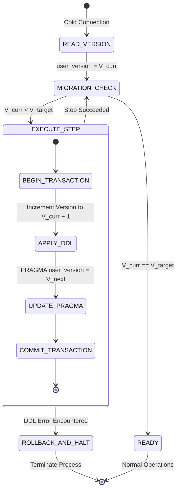

# Specification 02: Database Engine, WAL Concurrency & Relational Integrity

This specification defines the relational schema, Write-Ahead Logging (WAL) concurrency model, evolutionary transactional migrations, and cryptographic backup protocols for **WatchMark Media Tracker**.

---

## 📑 Table of Contents
1. [System Scope, Architecture & Boundary Placement](#1-system-scope-architecture--boundary-placement)
2. [Normative Requirements](#2-normative-requirements)
3. [Data Models, Entities & Relational Schema](#3-data-models-entities--relational-schema)
4. [Algorithmic Specifications & Mathematical Models](#4-algorithmic-specifications--mathematical-models)
5. [State Machines & Migration Lifecycle](#5-state-machines--migration-lifecycle)
6. [Interface Contracts & IPC Wire Protocols](#6-interface-contracts--ipc-wire-protocols)
7. [Security Architecture & Threat Modeling](#7-security-architecture--threat-modeling)
8. [Failure Modes, Resilience & Graceful Degradation Matrix](#8-failure-modes-resilience--graceful-degradation-matrix)

---

## 1. System Scope, Architecture & Boundary Placement

### 1.1 Scope & Purpose
The **Database and Concurrency Subsystem** provides persistent, ACID-compliant local storage for all library metadata, watch history, playback markers, and file associations. It operates exclusively as an embedded SQLite engine using Write-Ahead Logging to permit concurrent, non-blocking reads while native background threads perform metadata writes and scanner updates.

```mermaid
flowchart TD
    subgraph Client Runtimes
        SCAN[Media Scanner Thread]
        VLC[VLC Telemetry Loop]
        IPC[Frontend IPC Handler]
    end

    subgraph Synchronization Barrier
        LOCK[OnceLock Mutex Connection Pool]
    end

    subgraph SQLite Embedded Engine
        CORE[SQLite 3.x Native Engine]
        MEM[Page Cache & Memory-Mapped I/O]
        WAL[Write-Ahead Log: watchmark.db-wal]
        SHM[Shared Memory Index: watchmark.db-shm]
        DB[(Primary Store: watchmark.db)]
    end

    SCAN -->|Acquire Guard| LOCK
    VLC -->|Acquire Guard| LOCK
    IPC -->|Acquire Guard| LOCK
    LOCK --> CORE
    CORE <--> MEM
    CORE -->|Atomic Appends| WAL
    CORE <--> SHM
    WAL -.->|Passive / Truncate Checkpoint| DB
```



### 1.2 Non-Goals
* This subsystem **MUST NOT** accept arbitrary raw SQL statements dispatched across the IPC boundary from the frontend.
* This subsystem **MUST NOT** establish remote database network connections.
* This subsystem **MUST NOT** rely on external database daemon processes.

---

## 2. Normative Requirements

The key words **MUST**, **MUST NOT**, **REQUIRED**, **SHALL**, **SHALL NOT**, **SHOULD**, **SHOULD NOT**, **RECOMMENDED**, **MAY**, and **OPTIONAL** in this document are to be interpreted as described in [RFC 2119](https://datatracker.ietf.org/doc/html/rfc2119).

### 2.1 Functional Requirements (`FR`)
* **FR-02-01 (ACID Guarantees)**: All multi-entity modifications (e.g., removing a series and cascading its seasons, episodes, and history) **MUST** execute within an explicit atomic transaction (`BEGIN IMMEDIATE ... COMMIT`).
* **FR-02-02 (WAL Concurrency)**: The database connection **MUST** configure `PRAGMA journal_mode = WAL` and `PRAGMA synchronous = NORMAL` on every connection instantiation.
* **FR-02-03 (Referential Integrity)**: Foreign key enforcement **MUST** be explicitly activated via `PRAGMA foreign_keys = ON` on every connection initialization.
* **FR-02-04 (Evolutionary Migrations)**: Schema evolution **MUST** track versioning through `PRAGMA user_version`. Migrations **MUST** be sequential, idempotent, and non-destructive.
* **FR-02-05 (Cryptographic Backup Verification)**: Every scheduled or manual database backup **MUST** generate a companion `.sha256` digest file containing the cryptographic hash of the backup image.
* **FR-02-06 (Rolling Backup Rotation)**: The backup manager **MUST** maintain a configurable retention policy (default: 5 rolling backups), automatically pruning the oldest archives.

### 2.2 Non-Functional Requirements (`NFR`)
* **NFR-02-01 (Read Latency)**: Primary index lookups (fetching media cards or single episode state) **MUST** execute with $p99 \le 5\text{ ms}$.
* **NFR-02-02 (Write Throughput)**: Scanner batch ingestion **MUST** support committing $\ge 500$ file associations per second within a single transaction.
* **NFR-02-03 (Zero Data Loss on Crash)**: Power termination during a transaction **MUST NOT** corrupt the primary database file; recovery **MUST** occur automatically on the subsequent cold start via WAL replay.

---

## 3. Data Models, Entities & Relational Schema

### 3.1 Relational Data Dictionary

#### Entity: `Media`
Represents a top-level cinematic entity (Movie or Television Series).
* `id` (`INTEGER PRIMARY KEY AUTOINCREMENT`): System-internal unique identifier.
* `tmdb_id` (`INTEGER NOT NULL`): The Movie Database external identifier.
* `type` (`TEXT NOT NULL`): Entity discriminator (`'movie'` or `'tv'`).
* `title` (`TEXT NOT NULL`): Canonical display title.
* `overview` (`TEXT`): Extended synopsis.
* `poster_path` (`TEXT`): Local disk cache path to primary 2:3 vertical artwork.
* `backdrop_path` (`TEXT`): Local disk cache path to horizontal landscape artwork.
* `release_date` (`TEXT`): ISO 8601 release date (`YYYY-MM-DD`).
* `rating` (`REAL DEFAULT 0.0`): User-assigned rating ($0.0 \dots 10.0$).
* `status` (`TEXT DEFAULT 'Unwatched'`): State enum (`'Unwatched'`, `'Watching'`, `'Completed'`).
* `created_at` (`TIMESTAMP DEFAULT CURRENT_TIMESTAMP`): Ingestion timestamp.
* **Constraints**: `UNIQUE(tmdb_id, type)`

#### Entity: `Seasons`
Represents an individual season cycle belonging to a TV series.
* `id` (`INTEGER PRIMARY KEY AUTOINCREMENT`): System-internal identifier.
* `media_id` (`INTEGER NOT NULL`): Foreign key referencing `Media(id)` with `ON DELETE CASCADE`.
* `season_number` (`INTEGER NOT NULL`): Ordinal index (0 representing Specials).
* `name` (`TEXT`): Display title (e.g., `"Season 1"` or `"Specials"`).
* `poster_path` (`TEXT`): Season-specific artwork path.
* `overview` (`TEXT`): Season-level synopsis.
* `air_date` (`TEXT`): ISO 8601 initial broadcast date.
* **Constraints**: `UNIQUE(media_id, season_number)`

#### Entity: `Episodes`
Represents a specific playable video record.
* `id` (`INTEGER PRIMARY KEY AUTOINCREMENT`): System-internal identifier.
* `season_id` (`INTEGER NOT NULL`): Foreign key referencing `Seasons(id)` with `ON DELETE CASCADE`.
* `media_id` (`INTEGER NOT NULL`): Denormalized reference to `Media(id)` with `ON DELETE CASCADE`.
* `episode_number` (`INTEGER NOT NULL`): Ordinal episode number within the season.
* `title` (`TEXT NOT NULL`): Episode title.
* `overview` (`TEXT`): Episode synopsis.
* `still_path` (`TEXT`): 16:9 episodic screenshot cache path.
* `runtime` (`INTEGER DEFAULT 0`): Duration in minutes.
* `air_date` (`TEXT`): ISO 8601 episode air date.
* `status` (`TEXT DEFAULT 'Unwatched'`): Playback state enum (`'Unwatched'`, `'Watching'`, `'Completed'`).
* `last_position` (`INTEGER DEFAULT 0`): Playhead position marker in seconds.
* `watch_count` (`INTEGER DEFAULT 0`): Total number of completed playbacks.
* **Constraints**: `UNIQUE(media_id, season_number, episode_number)`

#### Entity: `Local_Files`
Represents the physical filesystem link to an Episode.
* `id` (`INTEGER PRIMARY KEY AUTOINCREMENT`): System-internal identifier.
* `episode_id` (`INTEGER NOT NULL UNIQUE`): Foreign key referencing `Episodes(id)` with `ON DELETE CASCADE`.
* `file_path` (`TEXT NOT NULL UNIQUE`): Absolute normalized filesystem path.
* `file_size` (`INTEGER NOT NULL`): Byte length of the physical file.
* `modified_time` (`INTEGER NOT NULL`): UNIX timestamp of filesystem modification.
* `format` (`TEXT`): Container format extension (e.g., `"mkv"`, `"mp4"`).

#### Entity: `History`
Represents an immutable log of distinct playback sessions.
* `id` (`INTEGER PRIMARY KEY AUTOINCREMENT`): System-internal log identifier.
* `episode_id` (`INTEGER NOT NULL`): Foreign key referencing `Episodes(id)` with `ON DELETE CASCADE`.
* `session_id` (`TEXT NOT NULL`): UUIDv4 identifying clustered playback sessions.
* `timestamp` (`INTEGER NOT NULL`): UNIX epoch time of session start.
* `start_time` (`TEXT`): Human-readable ISO UTC start timestamp.
* `end_time` (`TEXT`): Human-readable ISO UTC completion timestamp.
* `completion_ratio` (`REAL DEFAULT 0.0`): Highest fraction watched ($0.0 \dots 1.0$).
* `pause_count` (`INTEGER DEFAULT 0`): Total pause interactions recorded during session.
* `is_legacy` (`INTEGER DEFAULT 0`): Boolean flag indicating imported historical records.

#### Entity: `Unmatched_Files`
Persistent staging store for files requiring user review or manual disambiguation.
* `id` (`INTEGER PRIMARY KEY AUTOINCREMENT`): System-internal identifier.
* `file_path` (`TEXT NOT NULL UNIQUE`): Absolute path of unmapped video file.
* `parsed_title` (`TEXT`): Heuristically extracted preliminary title.
* `group_key` (`TEXT`): Folder-based or series-root clustering token.
* `created_at` (`TIMESTAMP DEFAULT CURRENT_TIMESTAMP`): Ingestion timestamp.

---

## 4. Algorithmic Specifications & Mathematical Models

### 4.1 Connection Pool Initialization & PRAGMA Sequence
Every connection instantiated by the pool **MUST** execute the initialization vector in exact order:

```text
Algorithm: InitializeDatabaseConnection(DatabasePath)
1. Connection := sqlite3_open_v2(DatabasePath, SQLITE_OPEN_READWRITE | SQLITE_OPEN_CREATE)
2. ExecutePragma(Connection, "journal_mode = WAL")
3. ExecutePragma(Connection, "synchronous = NORMAL")
4. ExecutePragma(Connection, "foreign_keys = ON")
5. ExecutePragma(Connection, "temp_store = MEMORY")
6. ExecutePragma(Connection, "mmap_size = 268435456")  // 256 MB Memory Mapped I/O
7. ExecutePragma(Connection, "cache_size = -64000")    // 64 MB Page Cache
8. CurrentVersion := QueryPragma(Connection, "user_version")
9. ExecuteMigrationPipeline(Connection, CurrentVersion)
10. Return Connection
```

### 4.2 Cryptographic Backup Verification Algorithm
Backups are created using the SQLite Online Backup API to ensure a transactionally consistent snapshot without taking the database offline:

```text
Algorithm: ExecuteDatabaseBackup(SourceConnection, BackupDirectory, RetentionDays)
1. Timestamp := FormatUTC(Now(), "YYYYMMDD_HHMMSS")
2. DestinationPath := BackupDirectory + "/watchmark_backup_" + Timestamp + ".db"
3. HashFilePath := DestinationPath + ".sha256"

4. DestinationConnection := sqlite3_open(DestinationPath)
5. BackupHandle := sqlite3_backup_init(DestinationConnection, "main", SourceConnection, "main")
6. loop:
       status := sqlite3_backup_step(BackupHandle, 256) // 256 pages per step
       if status == SQLITE_DONE then break
       if status != SQLITE_OK then
           sqlite3_backup_finish(BackupHandle)
           sqlite3_close(DestinationConnection)
           Raise Error("Backup failed during page copy")
7. sqlite3_backup_finish(BackupHandle)
8. sqlite3_close(DestinationConnection)

9. Compute SHA-256 Digest:
   HashContext := SHA256_Init()
   FileStream := OpenRead(DestinationPath)
   while Buffer := ReadChunk(FileStream, 65536) do:
       SHA256_Update(HashContext, Buffer)
   DigestHex := SHA256_FinalHex(HashContext)

10. Write Companion File:
    WriteFile(HashFilePath, DigestHex + " *" + BaseName(DestinationPath))

11. ExecutePruning(BackupDirectory, RetentionDays)
12. Return DestinationPath
```

---

## 5. State Machines & Migration Lifecycle

### 5.1 Evolutionary Migration State Machine



### 5.2 Schema Migration Registry

| Target Version | Migration Scope | Idempotency Safeguards |
| :--- | :--- | :--- |
| **V1** | Initial Relational Schema: `Media`, `Seasons`, `Episodes`, `Local_Files`, `History` | `CREATE TABLE IF NOT EXISTS` |
| **V2** | Persistent Triage Inbox: `Unmatched_Files` table creation | `CREATE TABLE IF NOT EXISTS` |
| **V3** | Secondary Performance Indexes: Indices on `file_path`, `media_id`, and `session_id` | `CREATE INDEX IF NOT EXISTS` |
| **V4** | Extended Telemetry Attributes: `is_legacy` column addition to `History` | Check `PRAGMA table_info(History)` before `ALTER TABLE` |
| **V5** | Denormalization Refinements: Direct `media_id` index in `Episodes` | Check `PRAGMA table_info(Episodes)` before `ALTER TABLE` |

---

## 6. Interface Contracts & IPC Wire Protocols

### 6.1 `optimize_database`
* **Direction**: Presentation Layer $\rightarrow$ Native Core
* **Action**: Executes index re-indexing, defragmentation, and WAL checkpoint truncation.
* **Return Contract Schema**:
```json
{
  "$schema": "https://json-schema.org/draft/2020-12/schema",
  "title": "DatabaseOptimizationResult",
  "type": "object",
  "properties": {
    "freed_bytes": { "type": "integer", "minimum": 0 },
    "duration_ms": { "type": "integer", "minimum": 0 },
    "pages_vacuumed": { "type": "integer", "minimum": 0 }
  },
  "required": ["freed_bytes", "duration_ms"]
}
```

### 6.2 `create_backup`
* **Direction**: Presentation Layer $\rightarrow$ Native Core
* **Return Contract Schema**:
```json
{
  "$schema": "https://json-schema.org/draft/2020-12/schema",
  "title": "BackupCreationResult",
  "type": "object",
  "properties": {
    "backup_path": { "type": "string" },
    "sha256_checksum": { "type": "string", "pattern": "^[a-f0-9]{64}$" },
    "file_size_bytes": { "type": "integer" }
  },
  "required": ["backup_path", "sha256_checksum", "file_size_bytes"]
}
```

---

## 7. Security Architecture & Threat Modeling

### 7.1 STRIDE Threat Analysis

| Threat Class | Vector | Mitigation Protocol |
| :--- | :--- | :--- |
| **SQL Injection** | Malicious media metadata or path characters injected into queries | Absolute prohibition of string-concatenated SQL queries. All interactions **MUST** use parameterized positional binding (`?` or `:param`). |
| **Tampering** | External tampering with backup images | SHA-256 verification before restoration. If the calculated digest does not match the companion `.sha256` file, restoration **MUST** abort. |
| **Denial of Service** | Unbounded lock contention freezing the presentation layer | Timeout-bounded mutex acquisition. If a lock cannot be acquired within 10 seconds, the operation returns a structured `DATABASE_BUSY` error. |
| **Information Disclosure** | Leakage of file paths or watch history via crash logs | Queries and error logs strip localized user directory roots before recording tracing diagnostics. |

---

## 8. Failure Modes, Resilience & Graceful Degradation Matrix

| Failure Mode | Trigger Condition | System Behavior | Recovery / Fallback |
| :--- | :--- | :--- | :--- |
| **Database Disk Full** | Available disk space falls below WAL checkpoint allocation | SQLite returns `SQLITE_FULL`. Operation is aborted. | Emits `database-disk-full` IPC event to UI; leaves existing database read-only. |
| **Power Failure during Write** | Hardware power severed during multi-row insert | Process terminates abruptly. Uncommitted data remains in WAL. | SQLite engine replays valid WAL records on cold reboot; partial transaction is discarded. |
| **Corrupt Backup File** | Bit-rot or accidental truncation of `.db` backup file | SHA-256 hash mismatch detected during restore probe. | Aborts restore; prevents overwriting the active database; prompts user with alert. |
| **Schema Migration Deadlock** | Application launched by legacy binary after schema update | `user_version` found higher than binary's target version. | Halts startup with explicit `VERSION_MISMATCH` alert requesting application update. |
