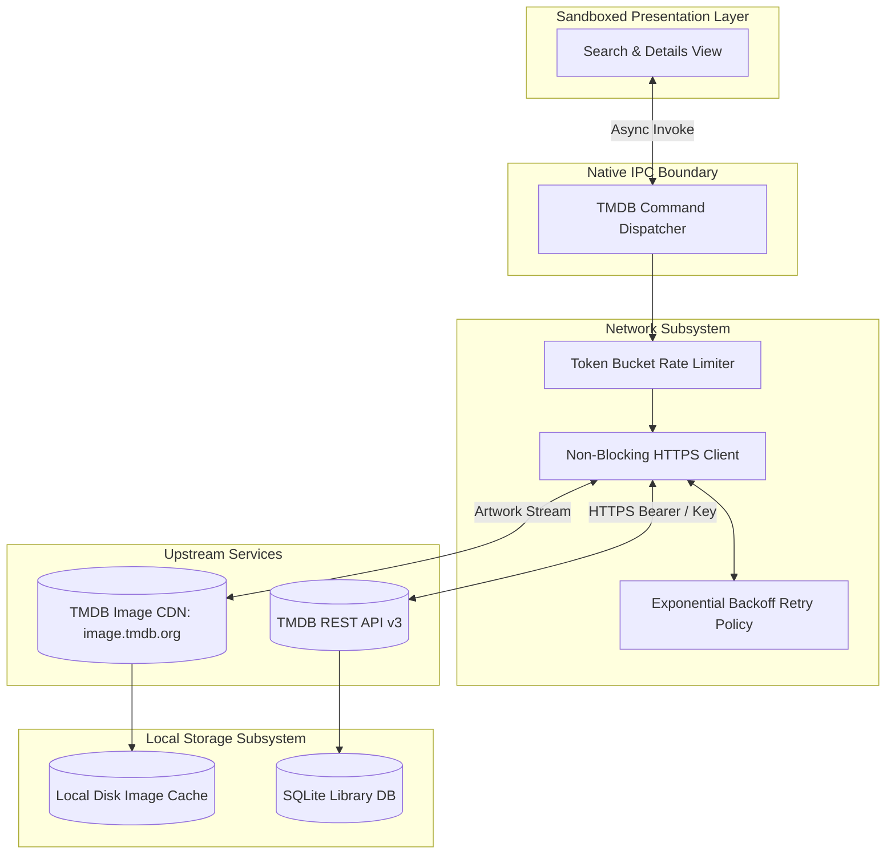
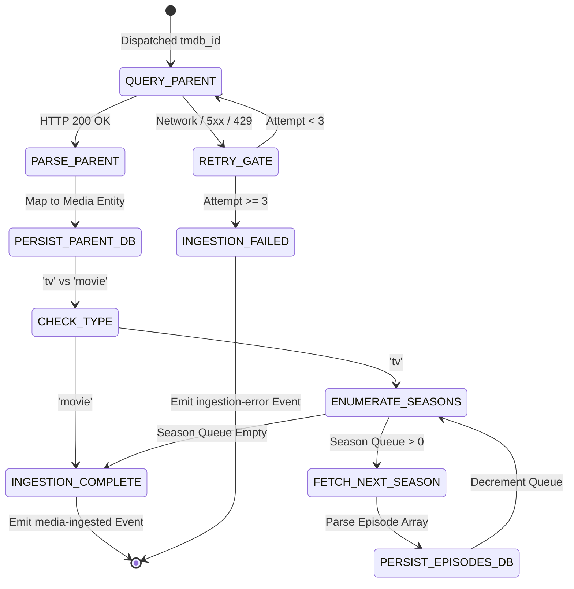

# Specification 03: TMDB Metadata Engine & Remote Synchronization

This specification defines the asynchronous network architecture, rate-limiting model, deep metadata ingestion pipelines, and three-tier image caching hierarchy of **WatchMark Media Tracker**.

---

## 📑 Table of Contents
1. [System Scope, Architecture & Boundary Placement](#1-system-scope-architecture--boundary-placement)
2. [Normative Requirements](#2-normative-requirements)
3. [Upstream Wire Protocol & Data Contracts](#3-upstream-wire-protocol--data-contracts)
4. [Algorithmic Specifications & Mathematical Models](#4-algorithmic-specifications--mathematical-models)
5. [State Machines & Ingestion Pipelines](#5-state-machines--ingestion-pipelines)
6. [Interface Contracts & IPC Wire Protocols](#6-interface-contracts--ipc-wire-protocols)
7. [Security Architecture & Threat Modeling](#7-security-architecture--threat-modeling)
8. [Failure Modes, Resilience & Graceful Degradation Matrix](#8-failure-modes-resilience--graceful-degradation-matrix)

---

## 1. System Scope, Architecture & Boundary Placement

### 1.1 Scope & Purpose
The **TMDB Metadata Engine** bridges the local media library with The Movie Database (TMDB) v3 REST API. It executes rate-limited, asynchronous queries to fetch official metadata (titles, overviews, broadcast dates, episode lists, and runtimes) and coordinates the multi-tier caching of artwork to guarantee offline viewing capabilities.



### 1.2 Non-Goals
* This subsystem **MUST NOT** store or transmit user viewing histories to external servers.
* This subsystem **MUST NOT** scrape third-party websites or pirate streaming sites.
* This subsystem **MUST NOT** block native worker threads during image download or network retry backoff loops.

---

## 2. Normative Requirements

The key words **MUST**, **MUST NOT**, **REQUIRED**, **SHALL**, **SHALL NOT**, **SHOULD**, **SHOULD NOT**, **RECOMMENDED**, **MAY**, and **OPTIONAL** in this document are to be interpreted as described in [RFC 2119](https://datatracker.ietf.org/doc/html/rfc2119).

### 2.1 Functional Requirements (`FR`)
* **FR-03-01 (Upstream Rate Limiting)**: Outbound requests to TMDB **MUST** pass through a token-bucket rate limiter ensuring outbound concurrency does not exceed $40\text{ requests} / 10\text{ seconds}$.
* **FR-03-02 (Exponential Backoff)**: Transient network dropouts (DNS resolution failures, socket timeouts, TCP resets) and HTTP `5xx` gateway errors **MUST** be retried up to 3 times using exponential backoff with jitter.
* **FR-03-03 (Rate Limit Adherence)**: When encountering HTTP `429 Too Many Requests`, the engine **MUST** suspend outbound queries for the duration specified in the upstream `Retry-After` header.
* **FR-03-04 (Three-Tier Asset Resolution)**: Image retrieval **MUST** query the 3-tier hierarchy: Local Cache $\rightarrow$ Remote CDN $\rightarrow$ Generated Offline Ghost Card.
* **FR-03-05 (Defensive Deserialization)**: Ingested payloads containing `null` values, missing keys, or string-encoded integer runtimes **MUST** be safely normalized to canonical types without terminating the ingestion pipeline.

### 2.2 Non-Functional Requirements (`NFR`)
* **NFR-03-01 (Connection Timeout)**: Outbound socket connection establishment **MUST** time out after $10\text{ seconds}$.
* **NFR-03-02 (Read Timeout)**: Inactive response stream reads **MUST** time out after $30\text{ seconds}$.
* **NFR-03-03 (Offline Resiliency)**: The application **MUST** remain fully functional in airplane mode, serving previously ingested metadata and artwork from local cache.

---

## 3. Upstream Wire Protocol & Data Contracts

### 3.1 Base Endpoints & Parameters
* **Base API URL**: `https://api.themoviedb.org/3`
* **Base CDN URL**: `https://image.tmdb.org/t/p/{size}`
* **Standard Poster Size**: `w500` ($500 \times 750\text{ px}$)
* **Standard Backdrop Size**: `w1280` ($1280 \times 720\text{ px}$)
* **Standard Still Size**: `w300` ($300 \times 169\text{ px}$)

### 3.2 Key Endpoint Contracts

#### Universal Multi-Search (`GET /search/multi`)
* **Query Parameters**: `api_key={key}&query={encoded_title}&page={page}&include_adult=false`
* **Normalized Ingestion Rule**: Filter results where `media_type` is `'movie'` or `'tv'`; discard `'person'` results.

#### TV Series Breakdown (`GET /tv/{series_id}`)
* **Query Parameters**: `api_key={key}&append_to_response=credits,external_ids`
* **Ingestion Action**: Creates or updates parent `Media` entity and enumerates all declared `seasons` entries for deferred deep ingestion.

#### Deep Season Breakdown (`GET /tv/{series_id}/season/{season_number}`)
* **Query Parameters**: `api_key={key}`
* **Ingestion Action**: Iterates through the `episodes` array, creating or updating records in the `Episodes` relational table.

---

## 4. Algorithmic Specifications & Mathematical Models

### 4.1 Exponential Backoff with Decorrelated Jitter
When an HTTP request fails due to a transient network error or HTTP `5xx`/`429`, the wait interval prior to attempt $k$ is calculated as:

$$t_{\text{wait}}(k) = \min\left(t_{\text{max}}, \; t_{\text{base}} \cdot 2^{k}\right) + \mathcal{U}\left(-\delta, \; \delta\right)$$

* **Base Delay ($t_{\text{base}}$)**: $500\text{ ms}$
* **Maximum Delay ($t_{\text{max}}$)**: $8,000\text{ ms}$
* **Maximum Retry Attempts ($k_{\max}$)**: $3$
* **Jitter Range ($\delta$)**: $\pm 20\% \text{ of calculated delay}$

If the response header `Retry-After` is present upon receiving HTTP `429`, the calculated $t_{\text{wait}}$ is superseded:

$$t_{\text{wait}} = \max\left(t_{\text{wait}}, \; \text{HeaderValue}(\text{Retry-After}) \times 1000\text{ ms}\right)$$

### 4.2 Three-Tier Image Resolution Algorithm
Artwork requests dispatched by the presentation layer are resolved according to the following decision procedure:

```text
Algorithm: ResolveMediaAsset(AssetType, RemotePath, Identifier)
1. If RemotePath is null or empty then:
       Return YieldGhostCard(AssetType, Identifier)

2. LocalFileName := SHA256(RemotePath) + ".jpg"
3. LocalDiskPath := LocalCacheDirectory + "/" + AssetType + "/" + LocalFileName

4. Tier 1: Check Local Storage
   if FileExists(LocalDiskPath) and FileSize(LocalDiskPath) > 0 then:
       Return URI("asset://localhost/" + LocalDiskPath)

5. Tier 2: Check Network Connectivity
   if NetworkIsOnline() then:
       ScheduleAsyncBackgroundDownload(RemotePath, LocalDiskPath)
       Return URI("https://image.tmdb.org/t/p/" + GetSize(AssetType) + RemotePath)

6. Tier 3: Offline Fallback
   Return YieldGhostCard(AssetType, Identifier)
```

---

## 5. State Machines & Ingestion Pipelines

### 5.1 Deep Media Ingestion State Machine



### 5.2 Defensive Deserialization Sanitization Rules

| Ingested Attribute | Raw Malformed Value | Canonical Normalized State |
| :--- | :--- | :--- |
| `overview` | `null` or `""` | `"No synopsis available for this title."` |
| `runtime` | `"45"` (String encoded) | `45` (Parsed integer) |
| `runtime` | `null` or missing | `0` (Flagged for VLC duration override) |
| `release_date` | `""` or invalid format | `"0000-00-00"` |
| `poster_path` | `null` | `null` (Triggers Ghost Card fallback) |
| `still_path` | `null` | `null` (Triggers season poster fallback) |

---

## 6. Interface Contracts & IPC Wire Protocols

### 6.1 `perform_tmdb_search`
* **Direction**: Presentation Layer $\rightarrow$ Native Core
* **Input Schema**:
```json
{
  "$schema": "https://json-schema.org/draft/2020-12/schema",
  "title": "TMDBSearchRequest",
  "type": "object",
  "properties": {
    "query": { "type": "string", "minLength": 1 },
    "year": { "type": ["string", "null"] },
    "page": { "type": "integer", "minimum": 1 }
  },
  "required": ["query"]
}
```
* **Output Schema**:
```json
{
  "$schema": "https://json-schema.org/draft/2020-12/schema",
  "title": "TMDBSearchResponse",
  "type": "array",
  "items": {
    "type": "object",
    "properties": {
      "tmdb_id": { "type": "integer" },
      "title": { "type": "string" },
      "media_type": { "type": "string", "enum": ["movie", "tv"] },
      "overview": { "type": "string" },
      "poster_path": { "type": ["string", "null"] },
      "backdrop_path": { "type": ["string", "null"] },
      "release_date": { "type": "string" }
    },
    "required": ["tmdb_id", "title", "media_type", "release_date"]
  }
}
```

---

## 7. Security Architecture & Threat Modeling

### 7.1 STRIDE Threat Analysis

| Threat Class | Vector | Mitigation Protocol |
| :--- | :--- | :--- |
| **Information Disclosure** | TMDB API key exposed via HTTP referer or query params | All communication **MUST** use HTTPS with strict TLS 1.2+ encryption. The API key is injected directly into native query structures and never logged. |
| **Tampering** | Man-in-the-Middle (MitM) image injection | Use of native system TLS trust stores (`rustls-native-certs`). Local cache filenames use SHA-256 hashes of the authoritative upstream path. |
| **Resource Exhaustion** | Runaway recursion downloading hundreds of seasons simultaneously | Rate limiting and batch queuing. Season ingestion executes sequentially with a maximum concurrency limit of 2 concurrent HTTP calls. |
| **Input Manipulation** | Path traversal sequences inside upstream image path strings | Upstream path values are strictly stripped of directory separators (`/`, `\`, `..`) prior to being combined with local filesystem cache paths. |

---

## 8. Failure Modes, Resilience & Graceful Degradation Matrix

| Failure Mode | Trigger Condition | System Behavior | Recovery / Fallback |
| :--- | :--- | :--- | :--- |
| **Invalid API Key** | User enters incorrect or revoked token in settings | Upstream returns HTTP `401 Unauthorized`. | Emits structured `INVALID_CREDENTIALS` error to UI; prompts key re-entry. |
| **Upstream Service Outage** | TMDB API unavailable (HTTP `500` / `503`) | Retries 3 times with exponential backoff. | Emits `UPSTREAM_UNAVAILABLE` notification; preserves existing library data. |
| **Rate Limit Triggered** | Ingestion exceeds 40 requests per 10-second window | Upstream returns HTTP `429`. | Parser pauses worker queue for `Retry-After` seconds before resuming. |
| **Network Disconnection** | Machine loses WiFi or Ethernet connectivity | Socket connection fails immediately. | UI switches to offline mode; serves all cached images and library metadata seamlessly. |
| **Disk Space Exhaustion** | Local disk cannot write downloaded poster image | I/O write returns `NoSpaceLeft`. | Discards partial image; displays in-memory Ghost Card; logs storage warning. |
