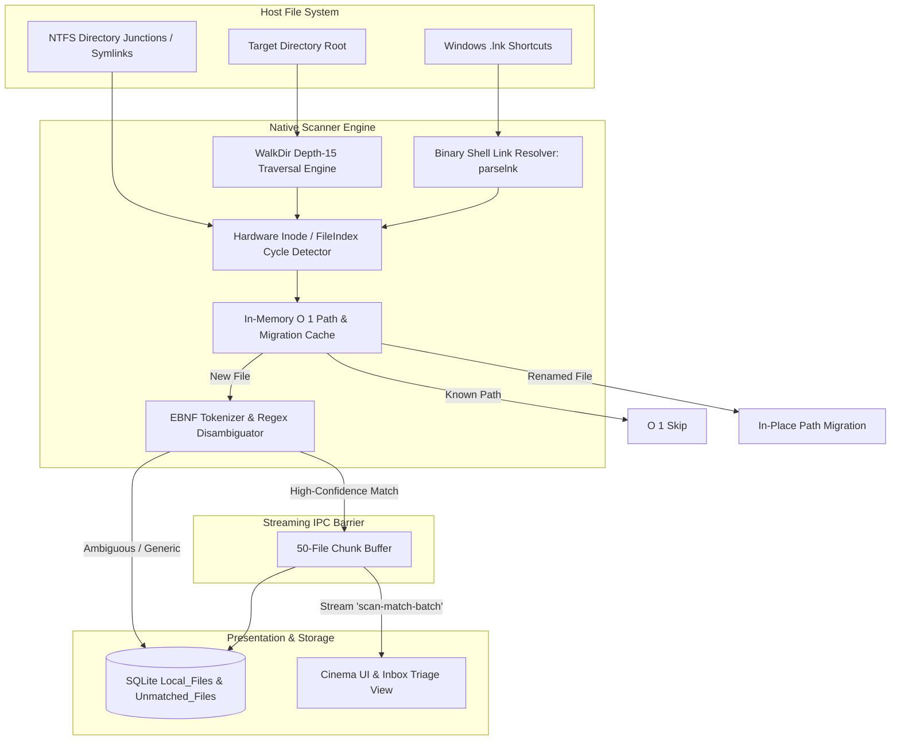
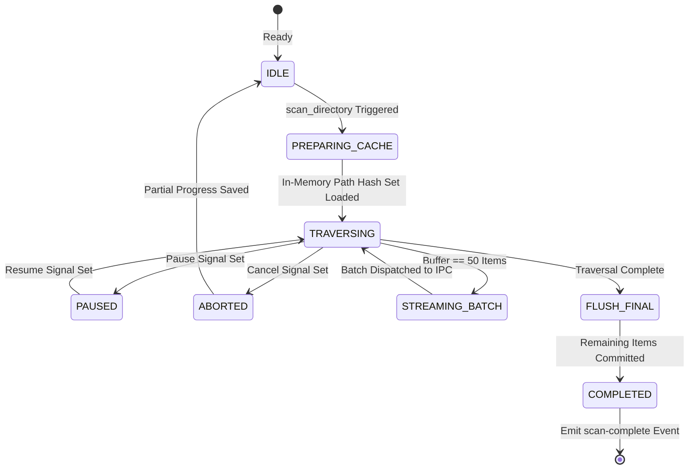
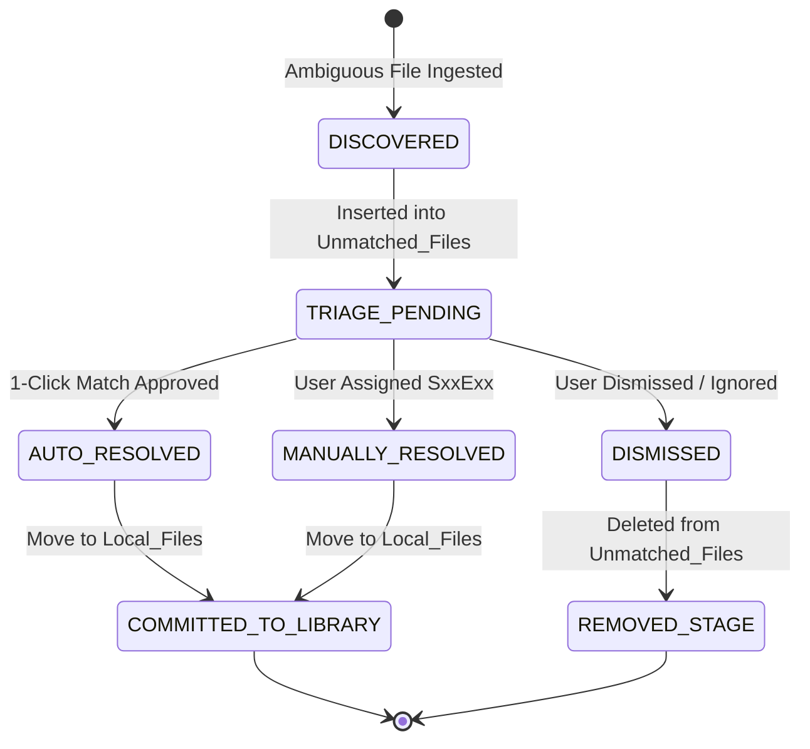

# Specification 04: High-Speed Media Scanner & Triage Inbox

This specification defines the file system traversal engine, hardware-level cycle detection, filename token grammar (EBNF), rename migration cache, and the persistent triage inbox of **WatchMark Media Tracker**.

---

## 📑 Table of Contents
1. [System Scope, Architecture & Boundary Placement](#1-system-scope-architecture--boundary-placement)
2. [Normative Requirements](#2-normative-requirements)
3. [Data Models, Entities & System Invariants](#3-data-models-entities--system-invariants)
4. [Algorithmic Specifications & Mathematical Models](#4-algorithmic-specifications--mathematical-models)
5. [State Machines & Ingestion Lifecycle](#5-state-machines--ingestion-lifecycle)
6. [Interface Contracts & IPC Wire Protocols](#6-interface-contracts--ipc-wire-protocols)
7. [Security Architecture & Threat Modeling](#7-security-architecture--threat-modeling)
8. [Failure Modes, Resilience & Graceful Degradation Matrix](#8-failure-modes-resilience--graceful-degradation-matrix)

---

## 1. System Scope, Architecture & Boundary Placement

### 1.1 Scope & Purpose
The **Media Scanner and Triage Inbox Subsystem** discovers, parses, and associates local video files with structured library records. It traverses deeply nested filesystem hierarchies, resolves Windows shell shortcuts (`.lnk`), normalizes noisy release filenames into clean semantic titles, and buffers ambiguous media inside a persistent staging inbox for interactive user triage.



### 1.2 Non-Goals
* This subsystem **MUST NOT** decode raw audio/video frames or inspect file byte payloads beyond filesystem metadata and shortcut headers.
* This subsystem **MUST NOT** delete, move, or modify original media files on disk.
* This subsystem **MUST NOT** block the presentation layer or run synchronous file I/O on the main IPC thread.

---

## 2. Normative Requirements

The key words **MUST**, **MUST NOT**, **REQUIRED**, **SHALL**, **SHALL NOT**, **SHOULD**, **SHOULD NOT**, **RECOMMENDED**, **MAY**, and **OPTIONAL** in this document are to be interpreted as described in [RFC 2119](https://datatracker.ietf.org/doc/html/rfc2119).

### 2.1 Functional Requirements (`FR`)
* **FR-04-01 (Recursive Traversal)**: The engine **MUST** recursively traverse directory trees up to a maximum depth of $15$ directory levels.
* **FR-04-02 (Hardware Cycle Prevention)**: Traversal **MUST** record hardware-level file system node identifiers to detect and abort infinite loops caused by circular directory junctions or symlinks.
* **FR-04-03 (Shortcut Resolution)**: Windows `.lnk` shortcut files **MUST** be resolved to their terminal physical target paths before parsing.
* **FR-04-04 (Long Path Support)**: On Windows platforms, traversal and file verification **MUST** prepend the `\\?\` verbatim namespace to bypass the Win32 $260$-character path limit (`MAX_PATH`).
* **FR-04-05 (Rename & Move Migration)**: When a previously tracked file disappears and a new file with matching file size, filename stem, and parent folder appears, the engine **MUST** update the existing record's path without resetting watch history.
* **FR-04-06 (Chunked Streaming)**: Matches **MUST** be emitted to the presentation layer in discrete batches of $50$ items over IPC events to avoid UI freezes.
* **FR-04-07 (Triage Persistence)**: Media files lacking unambiguous season or episode tokens **MUST** be persisted into the `Unmatched_Files` table.

### 2.2 Non-Functional Requirements (`NFR`)
* **NFR-04-01 (Throughput)**: Traversal speed **MUST** exceed $3,000\text{ files/second}$ on standard solid-state storage.
* **NFR-04-02 (Cancellation Latency)**: Upon receiving an asynchronous cancellation signal, the traversal engine **MUST** halt execution in $\le 100\text{ ms}$.
* **NFR-04-03 (Memory Ceiling)**: Scanner working memory (including path sets and migration caches) **MUST** remain below $35\text{ MB}$ RSS for libraries up to $50,000$ files.

---

## 3. Data Models, Entities & System Invariants

### 3.1 Relational Schema: `Unmatched_Files`
Files requiring user disambiguation are stored in this staging table:

| Column | Type | Constraints | Description |
| :--- | :--- | :--- | :--- |
| `id` | `INTEGER` | `PRIMARY KEY AUTOINCREMENT` | System-internal unique identifier. |
| `file_path` | `TEXT` | `NOT NULL UNIQUE` | Absolute, canonical filesystem path. |
| `parsed_title` | `TEXT` | `NULL` | Heuristically extracted candidate series or movie title. |
| `group_key` | `TEXT` | `NOT NULL` | Clustering key derived from parent directory or common prefix. |
| `created_at` | `TIMESTAMP` | `DEFAULT CURRENT_TIMESTAMP` | Initial ingestion timestamp. |

### 3.2 System Invariants
* **Invariant I-01 (Zero Duplicate Paths)**: No individual physical path may exist simultaneously in both `Local_Files` and `Unmatched_Files`.
* **Invariant I-02 (Cycle Termination Guarantee)**: Traversal of any directory graph $\mathcal{G} = (V, E)$, even if containing directed cycles, **MUST** terminate in finite time $\mathcal{O}(|V| + |E|)$.
* **Invariant I-03 (History Invariance on Move)**: File path migrations resulting from folder renames **MUST NOT** reset `watch_count`, `last_position`, or associated `History` records.

---

## 4. Algorithmic Specifications & Mathematical Models

### 4.1 Hardware-Level Cycle Identification Algorithm
To prevent infinite recursive loops from circular symbolic links or directory junctions, WatchMark extracts hardware-level node identities:

#### Windows Platform:
Queries `BY_HANDLE_FILE_INFORMATION` via Win32 File System APIs:
$$\text{FileIndex} = (\text{nFileIndexHigh} \ll 32) \mid \text{nFileIndexLow}$$
$$\text{NodeID}_{\text{win}} = \langle \text{dwVolumeSerialNumber}, \; \text{FileIndex} \rangle$$

#### POSIX Platforms (Linux / macOS):
Queries file system inode metadata:
$$\text{NodeID}_{\text{posix}} = \langle \text{metadata.dev}(), \; \text{metadata.ino}() \rangle$$

```text
Algorithm: TraverseDirectoryWithCycleGuard(RootPath, MaxDepth = 15)
1. VisitedNodes := Set<NodeID>()
2. CanonicalRoot := CanonicalizePath(RootPath)
3. ScanPath := PrependVerbatimPrefix(CanonicalRoot) // \\?\ on Windows

4. for entry in WalkDir(ScanPath, MaxDepth, FollowSymlinks = true):
       if CancelSignal.IsSet() then break
       while PauseSignal.IsSet() do Sleep(200ms)

       Path := ResolveIfShortcut(entry.Path) // Parses .lnk if applicable
       NodeID := GetHardwareNodeID(Path)

       if NodeID in VisitedNodes then:
           LogWarning("Cyclic junction detected, aborting branch: " + Path)
           Continue // Skip cyclic subtree

       VisitedNodes.Insert(NodeID)
       ProcessDiscoveredFile(Path)
```

### 4.2 Filename Token Grammar (Extended Backus-Naur Form)
Filename cleaning and extraction follows a formal grammar:

```ebnf
Filename          ::= [ ReleaseGroup ] Title Delimiter SeasonEpisode [ Extras ] Extension
ReleaseGroup      ::= ( "[" AnyString "]" | "(" AnyString ")" )

Title             ::= Word ( Delimiter Word )*
Word              ::= ( AlphaNumeric | ProtectedDotWord )+
ProtectedDotWord  ::= Alpha "." Alpha  (* e.g. "Mr. Robot", "S.H.I.E.L.D." *)

Delimiter         ::= ( " " | "." | "_" | "-" )+

SeasonEpisode     ::= StandardTV | AnimeBracketed | NaturalLanguage | MovieYear | AbsoluteEp

StandardTV        ::= ( "S" | "s" ) SeasonNum ( "E" | "e" ) EpisodeNum ( MultiEpRange )?
MultiEpRange      ::= ( "-" | "E" | "e" | "ep" ) EpisodeNum
SeasonNum         ::= Digit Digit?
EpisodeNum        ::= Digit Digit? Digit?

AnimeBracketed    ::= "[" SeasonNum "][" EpisodeNum "]"
NaturalLanguage   ::= ( "Season" | "season" ) SeasonNum ( "Episode" | "episode" ) EpisodeNum
MovieYear         ::= "(" Year ")" | Delimiter Year Delimiter
Year              ::= ( "19" | "20" ) Digit Digit
AbsoluteEp        ::= Delimiter Digit Digit Digit Delimiter

Extras            ::= ( JunkToken | Delimiter )*
JunkToken         ::= ( "1080p" | "720p" | "4k" | "2160p" | "x264" | "x265" | "HEVC" | 
                        "AAC" | "DTS" | "BluRay" | "WEBRip" | "WEB-DL" | "PROPER" | "REPACK" )
```

### 4.3 Rename Migration Heuristic Matching Algorithm
When a tracked file is missing from disk, it is matched against newly discovered unlinked files:

$$\text{MissingTuple} = \langle \text{size}, \; \text{filename\_stem}, \; \text{parent\_directory\_stem} \rangle$$

```text
Algorithm: MatchRenamedFile(NewFilePath, NewFileSize, MissingCache)
1. NewStem := GetFileNameStem(NewFilePath)
2. NewParent := GetParentDirectoryStem(NewFilePath)

3. ExactMatchKey := <NewFileSize, NewStem, NewParent>
4. if ExactMatchKey in MissingCache then:
       OldRecordID := MissingCache[ExactMatchKey]
       ExecuteSQL("UPDATE Local_Files SET file_path = ? WHERE id = ?", NewFilePath, OldRecordID)
       Return MigrationSuccess(OldRecordID)

5. Return MatchNotFound
```

---

## 5. State Machines & Ingestion Lifecycle

### 5.1 Scanner Finite State Machine (FSM)



### 5.2 Triage Inbox Lifecycle FSM



---

## 6. Interface Contracts & IPC Wire Protocols

### 6.1 `scan_directory`
* **Direction**: Presentation Layer $\rightarrow$ Native Core
* **Input Schema**:
```json
{
  "$schema": "https://json-schema.org/draft/2020-12/schema",
  "title": "ScanDirectoryRequest",
  "type": "object",
  "properties": {
    "directory_path": { "type": "string", "minLength": 1 },
    "supported_extensions": {
      "type": "array",
      "items": { "type": "string" }
    }
  },
  "required": ["directory_path"]
}
```

### 6.2 Streaming Event: `scan-match-batch`
* **Direction**: Native Core $\rightarrow$ Presentation Layer (Event Stream)
* **Payload Schema**:
```json
{
  "$schema": "https://json-schema.org/draft/2020-12/schema",
  "title": "ScanMatchBatchPayload",
  "type": "object",
  "properties": {
    "items": {
      "type": "array",
      "items": {
        "type": "object",
        "properties": {
          "file_path": { "type": "string" },
          "series_title": { "type": ["string", "null"] },
          "season_number": { "type": ["integer", "null"] },
          "episode_numbers": {
            "type": "array",
            "items": { "type": "integer" }
          },
          "file_size": { "type": "integer" }
        },
        "required": ["file_path", "episode_numbers", "file_size"]
      }
    }
  },
  "required": ["items"]
}
```

---

## 7. Security Architecture & Threat Modeling

### 7.1 STRIDE Threat Analysis

| Threat Class | Vector | Mitigation Protocol |
| :--- | :--- | :--- |
| **Denial of Service** | Circular directory junctions creating infinite traversal loops | Hardware-level node tracking (`VolumeSerial` + `FileIndex` on Windows; `dev` + `ino` on POSIX). Visited nodes are checked before recursing. |
| **Tampering / Traversal** | Path traversal via malicious `.lnk` shortcuts referencing system files | Canonicalization via `dunce::canonicalize`. Targets must resolve to verified local files with supported video extensions. |
| **Buffer Overflow** | Deeply nested directory paths exceeding standard 260-char Win32 limits | Verbatim `\\?\` prefix injected on absolute Windows paths. |
| **Resource Starvation** | Unbounded memory allocation caching millions of file paths | Streaming architecture: Matches are emitted in 50-item batches and evicted from scanner memory. Traversal recursion is hard-capped at depth 15. |

---

## 8. Failure Modes, Resilience & Graceful Degradation Matrix

| Failure Mode | Trigger Condition | System Behavior | Recovery / Fallback |
| :--- | :--- | :--- | :--- |
| **Permission Denied** | Protected system directory or inaccessible network share | Traversal catches `ErrorKind::PermissionDenied`. | Emits diagnostic warning to log; skips branch; continues sibling folders. |
| **Broken `.lnk` Shortcut** | Shortcut target file moved or deleted | Binary parsing succeeds, but target does not exist. | Logs broken link warning; discards entry without throwing exception. |
| **User Abort Signal** | User clicks "Cancel" in scanner UI | Atomic flag `CancelSignal` set to `true`. | Scanner cleanly breaks out of traversal loop; commits current batch. |
| **Corrupt Filename Characters** | Invalid UTF-8 or non-printable ASCII sequences in path | String conversion returns lossy replacement characters. | Path is handled via raw byte path APIs where possible; logged defensively. |
| **Network Drive Disconnection** | Mapped network drive drops connection mid-scan | I/O read timeout occurs on directory read. | Traversal halts for that root; preserves all items discovered prior to drop. |
