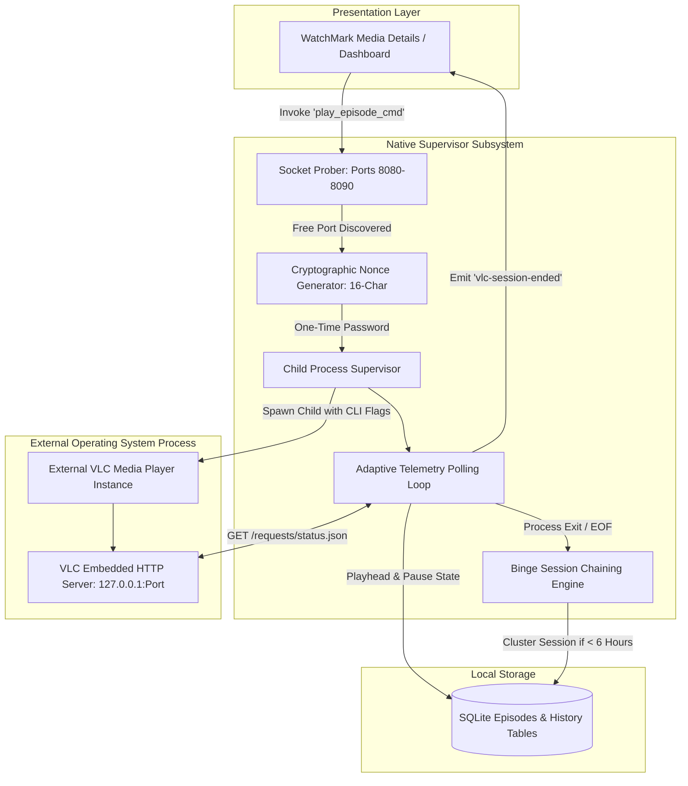
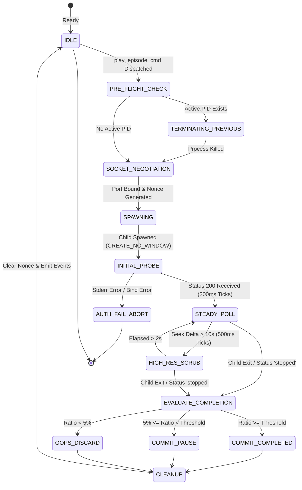

# Specification 05: VLC Telemetry & Playback Orchestration

This specification defines the process supervision model, dynamic socket negotiation, real-time HTTP telemetry loop, mathematical completion thresholds, and temporal binge session chaining for **WatchMark Media Tracker**.

---

## 📑 Table of Contents
1. [System Scope, Architecture & Boundary Placement](#1-system-scope-architecture--boundary-placement)
2. [Normative Requirements](#2-normative-requirements)
3. [Data Models, Entities & System Invariants](#3-data-models-entities--system-invariants)
4. [Algorithmic Specifications & Mathematical Models](#4-algorithmic-specifications--mathematical-models)
5. [State Machines & Playhead Lifecycle](#5-state-machines--playhead-lifecycle)
6. [Interface Contracts & IPC Wire Protocols](#6-interface-contracts--ipc-wire-protocols)
7. [Security Architecture & Threat Modeling](#7-security-architecture--threat-modeling)
8. [Failure Modes, Resilience & Graceful Degradation Matrix](#8-failure-modes-resilience--graceful-degradation-matrix)

---

## 1. System Scope, Architecture & Boundary Placement

### 1.1 Scope & Purpose
The **VLC Telemetry and Playback Orchestration Subsystem** supervises external media playback using the user's native VLC media player installation. It launches VLC in a sandboxed, automated configuration, establishes an authenticated loopback HTTP telemetry channel, tracks playhead progress, reconciles video runtimes, enforces completion thresholds, and groups sequential episodes into continuous binge-watching sessions.



### 1.2 Non-Goals
* This subsystem **MUST NOT** link dynamically or statically against `libvlc`; it interacts solely via standard OS process controls and the official HTTP interface.
* This subsystem **MUST NOT** modify or overwrite the user's global VLC configuration (`vlcrc`).
* This subsystem **MUST NOT** keep the telemetry polling loop active when VLC is closed (guaranteeing $0\%\text{ CPU}$ idle overhead).

---

## 2. Normative Requirements

The key words **MUST**, **MUST NOT**, **REQUIRED**, **SHALL**, **SHALL NOT**, **SHOULD**, **SHOULD NOT**, **RECOMMENDED**, **MAY**, and **OPTIONAL** in this document are to be interpreted as described in [RFC 2119](https://datatracker.ietf.org/doc/html/rfc2119).

### 2.1 Functional Requirements (`FR`)
* **FR-05-01 (Single Instance Enforcement)**: Only one active playback instance **MUST** be supervised at any time. Spawning a new video **MUST** terminate any previously supervised VLC process.
* **FR-05-02 (Dynamic Port Negotiation)**: The supervisor **MUST** scan TCP ports in the range $[8080, 8090]$ and bind to the first available local port.
* **FR-05-03 (Ephemeral Authentication)**: Every VLC launch **MUST** generate a unique $16$-character alphanumeric one-time password passed via `--http-password`. The password **MUST** be zeroized in memory upon session conclusion.
* **FR-05-04 (Playhead Resumption)**: If an episode possesses a valid `last_position` $> 0$, the supervisor **MUST** supply `--start-time={seconds}`, unless the saved marker is within $5\text{ seconds}$ of total duration (in which case it resets to $0$).
* **FR-05-05 (Adaptive Polling Frequencies)**: Telemetry polling **MUST** adapt dynamically across three operational tiers:
  1. *Initial Probe*: $200\text{ ms}$ interval (first $3\text{ seconds}$).
  2. *High-Resolution Scrub Mode*: $500\text{ ms}$ interval (active for $2\text{ seconds}$ following seeks $> 10\text{s}$).
  3. *Steady-State Heartbeat*: $5,000\text{ ms}$ interval.
* **FR-05-06 (Mathematical Completion Threshold)**: An episode **MUST** be marked `'Completed'` if the final playhead position reaches $\ge 90\%$ of total runtime (or $\frac{L - 30}{L}$ for media $< 5\text{ minutes}$).
* **FR-05-07 (Oops Guard Protection)**: Sessions terminating with $< 5\%$ engagement (or $< 10\text{ seconds}$ for short-form clips) **MUST** be classified as accidental opens and discarded from history without altering prior progress.
* **FR-05-08 (Temporal Binge Chaining)**: Sequential episodes belonging to the same `media_id` watched within $21,600\text{ seconds}$ ($6\text{ hours}$) of the preceding episode **MUST** inherit the existing `session_id`.

### 2.2 Non-Functional Requirements (`NFR`)
* **NFR-05-01 (Idle CPU Utilization)**: When playback is inactive, supervisor CPU usage **MUST** measure $0.0\%$.
* **NFR-05-02 (Telemetry Overhead)**: Steady-state polling **MUST NOT** exceed $1$ loopback HTTP request every $5\text{ seconds}$.
* **NFR-05-03 (Process Terminate Latency)**: Forcible termination of orphaned VLC processes **MUST** complete in $\le 500\text{ ms}$.

---

## 3. Data Models, Entities & System Invariants

### 3.1 Ephemeral Memory State Entities
The supervisor maintains synchronized in-memory state:
* `ACTIVE_VLC`: Global atomic storing the active OS Process ID (`PID`).
* `VLC_PORT`: Mutex-protected TCP port (`u16`) currently assigned to the loopback interface.
* `VLC_PASSWORD`: Mutex-protected string containing the active session's ephemeral password.
* `LIVE_PLAYBACK_TIME`: Read-write lock storing the real-time position in seconds for UI sync.

### 3.2 System Invariants
* **Invariant I-01 (Zero-Trust Loopback)**: The embedded VLC HTTP server **MUST** listen strictly on `127.0.0.1` and never bind to `0.0.0.0` or external network adapters.
* **Invariant I-02 (Password Ephemerality)**: The session password **MUST** be cleared from process memory immediately upon VLC termination.
* **Invariant I-03 (Series Isolation in Binge Chaining)**: Binge chaining is strictly partitioned by `media_id`. An episode from Series B **MUST NEVER** chain into an active session from Series A, regardless of temporal proximity.

---

## 4. Algorithmic Specifications & Mathematical Models

### 4.1 Dynamic Socket Negotiation Protocol
Before launching the VLC executable, the supervisor negotiates a free TCP loopback port:

```text
Algorithm: NegotiateFreePort(MinPort = 8080, MaxPort = 8090)
1. for Port := MinPort to MaxPort do:
       Attempt TCP listener bind on ("127.0.0.1", Port)
       if Bind succeeds then:
           Close Listener
           Return Port
2. Raise Error("No available TCP port found in range 8080-8090")
```

### 4.2 Mathematical Progress, Completion & Oops Guard Models

Let:
* $L \in \mathbb{R}^+$ be the total video duration in seconds.
* $t \in [0, L]$ be the current playhead position in seconds.
* $H = \max_{0 \le \tau \le t_{\text{session}}} \left( \frac{\tau}{L} \right)$ be the session high-water mark ratio.
* $t_{\text{final}}$ be the playhead position immediately preceding session termination.

#### 1. Completion Threshold Function ($C_{\text{thresh}}$):
For standard media ($L \ge 300\text{s}$):
$$C_{\text{thresh}}(L) = 0.90 \quad (90\%)$$

For short-form media and clips ($L < 300\text{s}$):
$$C_{\text{thresh}}(L) = \frac{L - 30}{L}$$

#### 2. Rapid Scrubbing Guard:
If a user scrubs directly into the final credits and allows the video to terminate:
$$\text{IsRapidScrub} = (1.0 - H < 0.01) \land (L - t_{\text{final}} \le 10\text{s})$$

#### 3. Final State Evaluation:
$$\text{MarkCompleted} \iff \left( \frac{t_{\text{final}}}{L} \ge C_{\text{thresh}}(L) \right) \lor \text{IsRapidScrub}$$

#### 4. Oops Guard (Engagement Floor):
To filter accidental clicks and immediate closes:
$$\text{IsEngaged} \iff \begin{cases} 
H \cdot L \ge 10\text{s} & \text{if } L < 300\text{s} \\
H \ge 0.05 \; (5\%) & \text{if } L \ge 300\text{s}
\end{cases}$$

If $\neg \text{IsEngaged}$ and $t_{\text{final}} \le 1.0\text{s}$:
* The session record in `History` is deleted.
* If prior progress existed (`last_position > 1`), it is preserved intact.
* If no prior progress existed, status remains `'Unwatched'`.

#### 5. Zero-Second Reset Mechanism:
If the user explicitly seeks to $t \le 1.0\text{s}$ after genuine engagement ($H \cdot L > 5.0\text{s}$):
* Status reverts to `'Unwatched'`.
* `last_position` is reset to $0$.

### 4.3 Temporal Binge Chaining Algorithm
When an episode concludes, the session clustering logic determines whether to extend the current binge session or initiate a new one:

$$\Delta t = \text{Timestamp}_{\text{current}} - \text{Timestamp}_{\text{last}}$$

```text
Algorithm: ResolveBingeSession(MediaID, CurrentTimestamp)
1. Query last history entry:
   LastEntry := SELECT session_id, timestamp, media_id FROM History ORDER BY timestamp DESC LIMIT 1
2. if LastEntry is not null then:
       if LastEntry.media_id == MediaID and (CurrentTimestamp - LastEntry.timestamp) < 21600 then:
           Return LastEntry.session_id // Continue 6-hour binge session
3. Return GenerateUUIDv4() // Initiate new distinct session
```

---

## 5. State Machines & Playhead Lifecycle

### 5.1 Player Supervision Finite State Machine (FSM)



---

## 6. Interface Contracts & IPC Wire Protocols

### 6.1 `play_episode`
* **Direction**: Presentation Layer $\rightarrow$ Native Core
* **Input Schema**:
```json
{
  "$schema": "https://json-schema.org/draft/2020-12/schema",
  "title": "PlayEpisodeRequest",
  "type": "object",
  "properties": {
    "episode_id": { "type": "integer", "minimum": 1 },
    "file_path": { "type": "string", "minLength": 1 },
    "last_position": { "type": "integer", "minimum": 0 }
  },
  "required": ["episode_id", "file_path", "last_position"]
}
```

### 6.2 Event Notification: `vlc-session-ended`
* **Direction**: Native Core $\rightarrow$ Presentation Layer (Event Stream)
* **Payload Schema**:
```json
{
  "$schema": "https://json-schema.org/draft/2020-12/schema",
  "title": "VlcSessionEndedPayload",
  "type": "object",
  "properties": {
    "media_id": { "type": "integer" },
    "episode_id": { "type": "integer" },
    "final_status": {
      "type": "string",
      "enum": ["Completed", "Watching", "Ignored"]
    },
    "watch_time_seconds": { "type": "number" },
    "completion_ratio": { "type": "number", "minimum": 0.0, "maximum": 1.0 }
  },
  "required": ["media_id", "episode_id", "final_status"]
}
```

---

## 7. Security Architecture & Threat Modeling

### 7.1 STRIDE Threat Analysis

| Threat Class | Vector | Mitigation Protocol |
| :--- | :--- | :--- |
| **Command Injection** | Malicious shell metacharacters inside video file paths | Direct process execution via `std::process::Command` without shell expansion (`sh -c` or `cmd.exe /c`). Paths are passed as discrete vector arguments. |
| **Port Hijacking** | Malicious local software connecting to the VLC HTTP interface | Random 16-character alphanumeric password generated per launch. Interface bound strictly to loopback `127.0.0.1`. |
| **Path Traversal / Verbatim Parsing** | Windows Long Path `\\?\` prefix breaking VLC URI encoder | The supervisor strips the `\\?\` verbatim prefix prior to passing the path argument to VLC, while maintaining canonical verification. |
| **Process Leaks** | Zombie VLC instances surviving application crashes | Supervisor tracks `ACTIVE_VLC` PID. Startup routines and shutdown hooks dispatch SIGKILL / `taskkill /F` against orphaned instances. |

---

## 8. Failure Modes, Resilience & Graceful Degradation Matrix

| Failure Mode | Trigger Condition | System Behavior | Recovery / Fallback |
| :--- | :--- | :--- | :--- |
| **VLC Path Not Configured** | User has not set executable path in settings | Validation fails prior to spawn attempt. | Returns structured `VLC_NOT_CONFIGURED` error; opens Settings modal. |
| **Port Exhaustion** | Ports 8080 through 8090 all occupied by other services | Socket probe loop completes without finding free port. | Aborts launch; alerts user that HTTP interface ports are obstructed. |
| **HTTP Authentication Error** | VLC instance fails to register ephemeral password | Non-blocking stderr scanner catches `"password"` or `"bind"` error. | Terminates child process immediately; returns `VLC_AUTH_ERROR`. |
| **Sudden Process Crash** | Video codec crash causes VLC to terminate abnormally | `proc.wait()` resolves with non-zero exit code. | Commits playhead up to last heartbeat; emits `vlc-crashed` event to UI. |
| **Zero-Length Stream** | Live capture or damaged container with missing index | VLC reports `length = 0.0`. | Activates fallback mode; emits `vlc-livestream-fallback` event to UI. |
