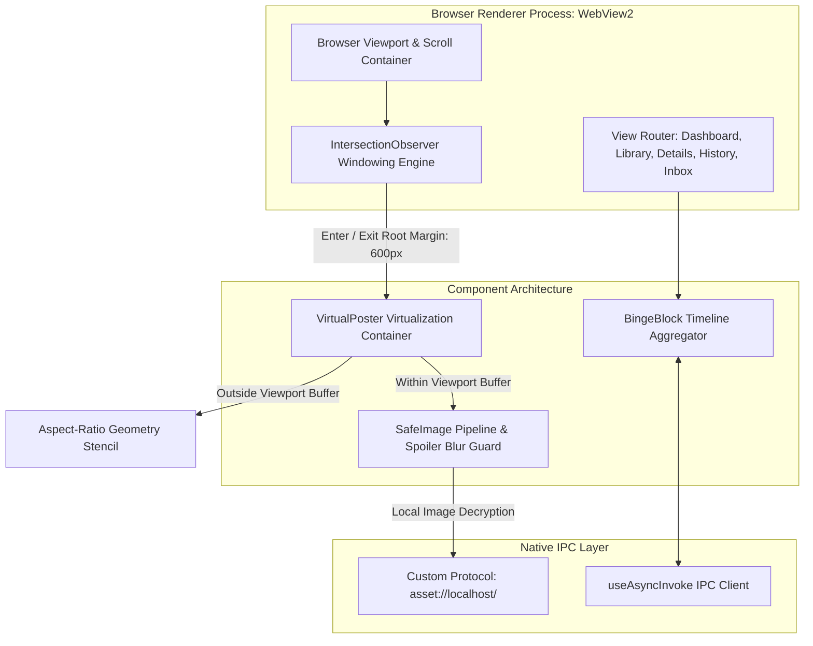
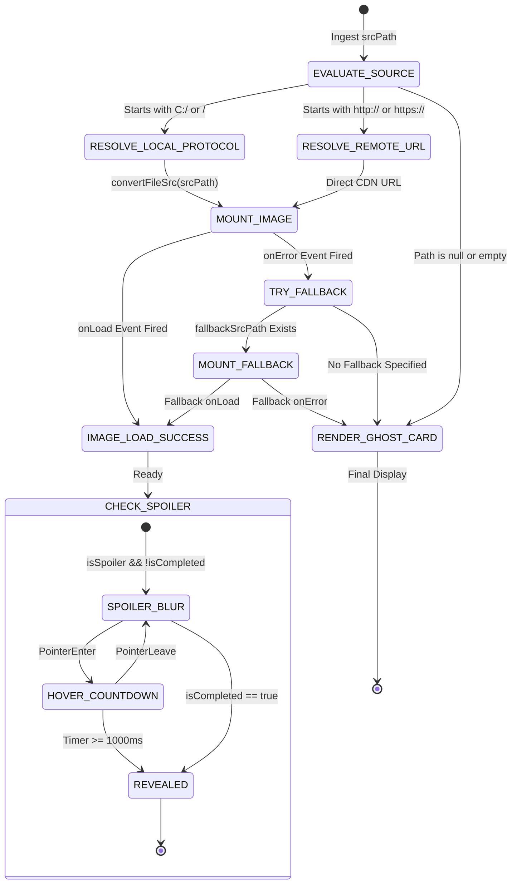

# Specification 06: Cinema UI Design System & Viewport Virtualization

This specification defines the visual design system, viewport DOM virtualization engine, three-tier image rendering pipeline, temporal timeline clustering, and low-power accessibility profiles of **WatchMark Media Tracker**.

---

## 📑 Table of Contents
1. [System Scope, Architecture & Boundary Placement](#1-system-scope-architecture--boundary-placement)
2. [Normative Requirements](#2-normative-requirements)
3. [Design System Tokens & Geometry Invariants](#3-design-system-tokens--geometry-invariants)
4. [Algorithmic Specifications & Mathematical Models](#4-algorithmic-specifications--mathematical-models)
5. [State Machines & Component Lifecycles](#5-state-machines--component-lifecycles)
6. [Interface Contracts & Component Specifications](#6-interface-contracts--component-specifications)
7. [Accessibility, Power Management & Threat Modeling](#7-accessibility-power-management--threat-modeling)
8. [Failure Modes, Resilience & Graceful Degradation Matrix](#8-failure-modes-resilience--graceful-degradation-matrix)

---

## 1. System Scope, Architecture & Boundary Placement

### 1.1 Scope & Purpose
The **Cinema UI Design System Subsystem** defines the presentation architecture of WatchMark. It delivers a cinema-grade dark aesthetic optimized for high-density media libraries, enforces zero-layout-shift image loading, unmounts offscreen elements via viewport windowing to maintain fixed memory ceilings, and renders interactive binge-watching timelines.



### 1.2 Non-Goals
* This subsystem **MUST NOT** execute synchronous disk or network operations inside the UI thread.
* This subsystem **MUST NOT** mutate database entities directly without calling native IPC commands.
* This subsystem **MUST NOT** retain off-screen heavy DOM nodes (such as uncompressed high-resolution backdrops) in memory during rapid scrolling.

---

## 2. Normative Requirements

The key words **MUST**, **MUST NOT**, **REQUIRED**, **SHALL**, **SHALL NOT**, **SHOULD**, **SHOULD NOT**, **RECOMMENDED**, **MAY**, and **OPTIONAL** in this document are to be interpreted as described in [RFC 2119](https://datatracker.ietf.org/doc/html/rfc2119).

### 2.1 Functional Requirements (`FR`)
* **FR-06-01 (Virtualization Windowing)**: Media grids containing poster cards **MUST** virtualize rendering using `IntersectionObserver` with a vertical root margin of $600\text{ px}$.
* **FR-06-02 (Zero Layout Shift)**: Off-screen unmounted cards **MUST** retain their exact physical box geometry (`aspect-[2/3]`) to prevent scrollbar jumping or layout recalculation reflows.
* **FR-06-03 (Spoiler Obfuscation)**: Episodic preview stills for unwatched episodes marked as potential spoilers **MUST** apply a heavy CSS blur ($20\text{ px}$), requiring a deliberate $1,000\text{ ms}$ hover hold or episode completion to unmask.
* **FR-06-04 (Diurnal Vibe Classification)**: Playback sessions **MUST** be classified into diurnal time buckets (Morning, Afternoon, Evening, Late Night) based on the local session start timestamp.
* **FR-06-05 (Midnight Crossover Indication)**: Binge sessions crossing midnight calendar dates **MUST** display a distinct celestial visual marker.
* **FR-06-06 (Reduced-Motion Compliance)**: When the operating system signals `prefers-reduced-motion: reduce`, all CSS transitions **MUST** collapse to $0\text{ ms}$, and expensive `backdrop-filter` blurs **MUST** be stripped in favor of solid surface colors.

### 2.2 Non-Functional Requirements (`NFR`)
* **NFR-06-01 (Rendering Frame Rate)**: Media grid scrolling **MUST** sustain $60\text{ frames per second}$ on standard modern hardware.
* **NFR-06-02 (Memory Ceiling)**: Rendering a library of $1,000+$ titles **MUST NOT** cause renderer working set memory to exceed $50\text{ MB}$.
* **NFR-06-03 (Cold Start Visual Flash)**: The root HTML element **MUST** initialize with the `#0D0F14` dark palette to eliminate white-screen visual flashes during webview initialization.

---

## 3. Design System Tokens & Geometry Invariants

### 3.1 Color Space Tokens

| Semantic Token | Hex Code | RGB / Alpha | Usage |
| :--- | :--- | :--- | :--- |
| `background-root` | `#0D0F14` | `rgb(13, 15, 20)` | Deep void background applied to root body. |
| `surface-card` | `#1F222A` | `rgba(31, 34, 42, 0.6)` | Translucent glassmorphism surface panels. |
| `surface-card-hover` | `#252830` | `rgb(37, 40, 48)` | Hover elevation surface color. |
| `border-subtle` | `#2A2D35` | `rgba(42, 45, 53, 0.4)` | Fine structural borders ($1\text{ px}$). |
| `accent-primary` | `#FF6B00` | `rgb(255, 107, 0)` | Signature VLC Orange for action buttons and ratings. |
| `accent-hover` | `#FF8533` | `rgb(255, 133, 51)` | Primary action hover state. |
| `text-primary` | `#FFFFFF` | `rgb(255, 255, 255)` | High-contrast title typography. |
| `text-secondary` | `#A0AEC0` | `rgb(160, 174, 192)` | Secondary metadata, dates, and overviews. |

### 3.2 Dimensional Aspect Ratio Invariants
* **Vertical Poster Ratio**: $2:3$ (`aspect-[2/3]`). Enforced across all library grid and search result items.
* **Horizontal Landscape Ratio**: $16:9$ (`aspect-video` or `aspect-[16/9]`). Enforced across episodic stills and hero backdrops.
* **Custom Scrollbar Width**: $6\text{ px}$ fixed width, rounded radius $4\text{ px}$, thumb colored in `border-subtle` with hover transition to `accent-primary`.

---

## 4. Algorithmic Specifications & Mathematical Models

### 4.1 DOM Virtualization Windowing Engine (`VirtualPoster`)
To support massive media collections without DOM node explosion, the windowing engine operates using root margin spatial projection:

$$\text{Viewport Height} = H_{\text{vp}}, \quad \text{Margin Buffer} = 600\text{ px}$$
$$\text{Active Render Zone} = [Y_{\text{top}} - 600\text{ px}, \; Y_{\text{bottom}} + 600\text{ px}]$$

```text
Algorithm: EvaluateVirtualVisibility(ElementBounds, ViewportBounds)
1. Let Y_top := ViewportBounds.Top - 600
2. Let Y_bottom := ViewportBounds.Bottom + 600

3. if ElementBounds.Bottom >= Y_top and ElementBounds.Top <= Y_bottom then:
       State.IsVisible := true
       State.HasLoadedOnce := true
       MountChildren() // Mounts heavy image and interaction tree
   else:
       State.IsVisible := false
       if State.HasLoadedOnce then:
           UnmountChildren()
           RenderGeometryStencil() // Renders empty 2:3 transparent div
```

### 4.2 Diurnal Vibe Classification Model
Session start timestamps ($t_{\text{start}}$) are mapped to diurnal psychological categories based on 24-hour local time:

$$\text{Hour}(t) = \text{LocalHourOf}(t) \in [0, 23]$$

$$\text{Vibe}(t) = \begin{cases} 
\text{"Morning"} & \text{if } 5 \le \text{Hour}(t) < 12 \\
\text{"Afternoon"} & \text{if } 12 \le \text{Hour}(t) < 17 \\
\text{"Evening"} & \text{if } 17 \le \text{Hour}(t) < 21 \\
\text{"Late Night"} & \text{if } 21 \le \text{Hour}(t) \le 23 \lor 0 \le \text{Hour}(t) < 5
\end{cases}$$

### 4.3 Midnight Crossover Detection Model
Given session start date $D_{\text{start}}$ and session conclusion date $D_{\text{end}}$:

$$\text{HasMidnightCrossover} \iff \text{Day}(D_{\text{start}}) \neq \text{Day}(D_{\text{end}}) \lor \text{Month}(D_{\text{start}}) \neq \text{Month}(D_{\text{end}})$$

When true, the timeline block mounts the celestial `<Moon />` icon and formats the subtitle as:
$$\text{DayName}(D_{\text{start}}) \; \text{Vibe}(D_{\text{start}}) \; \text{--} \; \text{DayName}(D_{\text{end}}) \; \text{Vibe}(D_{\text{end}})$$

---

## 5. State Machines & Component Lifecycles

### 5.1 `SafeImage` Rendering & Fallback FSM



---

## 6. Interface Contracts & Component Specifications

### 6.1 `VirtualPosterProps` Specification
Container ensuring high-speed virtualization of vertical media items:
* `children` (`ReactNode`, Required): The inner interactive card component.
* `className` (`string`, Optional): Outer styling and grid placement utility classes.
* `heightClass` (`string`, Default: `"aspect-[2/3]"`): CSS aspect ratio geometry clamp.

### 6.2 `SafeImageProps` Specification
Asset rendering component with fallback and spoiler protection:
* `srcPath` (`string`, Required): Primary asset path (local filesystem or remote CDN).
* `type` (`'poster' | 'backdrop' | 'still'`, Required): Image type classification.
* `altText` (`string`, Required): Accessible image description.
* `fallbackSrcPath` (`string`, Optional): Secondary fallback asset path.
* `potentialSpoiler` (`boolean`, Default: `false`): Enables hover blur guard.
* `isCompleted` (`boolean`, Default: `false`): Bypasses spoiler blur if true.
* `title` (`string`, Optional): Title text rendered inside Ghost Card fallback.

---

## 7. Accessibility, Power Management & Threat Modeling

### 7.1 Low-Power & Reduced-Motion Accessibility Profile
On portable devices running on battery saver or when the operating system has enabled reduced-motion accessibility flags, the presentation layer activates a hardware conservation profile:

```css
@media (prefers-reduced-motion: reduce) {
  * {
    transition-duration: 0ms !important;
    animation-duration: 0ms !important;
  }

  /* Strip expensive GPU backdrop filters to eliminate fill-rate spikes */
  .backdrop-blur-sm,
  .backdrop-blur-md,
  .backdrop-blur-lg,
  [class*="backdrop-blur"] {
    backdrop-filter: none !important;
    background-color: #0D0F14 !important;
  }
}
```

### 7.2 High-Brightness Background Double-Guard
When light or high-brightness backdrops are loaded behind white titles, text legibility is protected through an automatic double-guard shadow:
```css
.text-double-guard {
  text-shadow: 0 2px 4px rgba(0, 0, 0, 0.8), 0 0 12px rgba(0, 0, 0, 0.6);
}
```

---

## 8. Failure Modes, Resilience & Graceful Degradation Matrix

| Failure Mode | Trigger Condition | System Behavior | Recovery / Fallback |
| :--- | :--- | :--- | :--- |
| **Missing Image File** | Local cache file deleted externally by user or disk cleaner | `` emits `onError`. | Falls back silently to secondary CDN URL or renders Ghost Card. |
| **Network Loss in Offline Mode** | Remote CDN unavailable while browsing un-cached media | HTTP image fetch returns network error. | Instantly mounts dark gradient SVG Ghost Card with centered series title. |
| **Rapid Scrubbing DOM Surge** | User rapidly drags scrollbar across 5,000 items | Elements scroll into and out of view in milliseconds. | `VirtualPoster` unmounts offscreen nodes instantly; browser memory remains constant. |
| **Low-End GPU Stutter** | Integrated GPU struggles with multi-layer blur blending | Frame rate drops during view transitions. | Automatically degrades by stripping `backdrop-filter` via CSS media queries. |
| **Text Selection Mis-clicks** | User selects text on collapsible accordion header | Click event could trigger unwanted collapse. | Selection guard (`window.getSelection()?.toString()`) aborts toggle action. |
