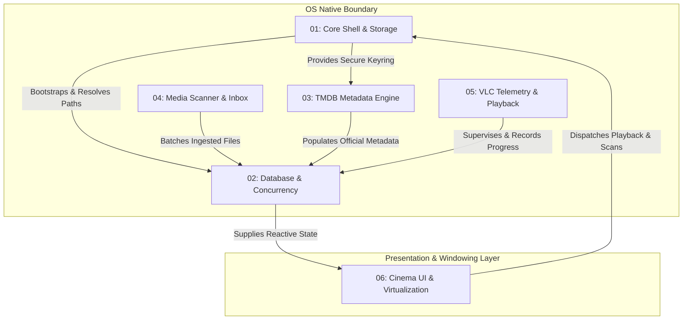

# WatchMark Technical Specifications Suite

This directory contains the formal, production-grade engineering specifications for the **WatchMark Media Tracker**. All specifications adhere strictly to systems engineering standards ([ISO/IEC/IEEE 29148:2018](https://standards.ieee.org/ieee/29148/7292/)) and normative keyword definitions ([RFC 2119](https://datatracker.ietf.org/doc/html/rfc2119)).

---

## 🏛️ Subsystem Architecture & Dependency Topology

---

## 📑 Specification Registry

| Specification Document | Subsystem Scope | Core Invariants & Protocols |
| :--- | :--- | :--- |
| [**01: Core Shell, Lifecycle & OS Boundaries**](./01_CORE_SHELL_AND_STORAGE.md) | App initialization, OS AppData topology, canary access probe, OS Keyring security model, and multi-monitor window geometry clamping. | Canary probe protocol, single-instance mutex, OS Credential Manager isolation, defensive settings repair. |
| [**02: Database Engine, WAL Concurrency & Integrity**](./02_DATABASE_AND_CONCURRENCY.md) | Embedded SQLite relational engine, Write-Ahead Logging (WAL) concurrency, foreign key cascade rules, evolutionary migrations, and SHA-256 backup verification. | `PRAGMA journal_mode=WAL`, ACID transactions, `user_version` migration state machine, rolling backup rotation. |
| [**03: TMDB Metadata Engine & Synchronization**](./03_TMDB_METADATA_ENGINE.md) | Asynchronous network client, token-bucket rate limiting ($40\text{ req}/10\text{s}$), exponential backoff with jitter, and 3-tier artwork resolution hierarchy. | Upstream wire protocol, leaky bucket limiter, exponential backoff equation, Ghost Card offline fallback. |
| [**04: High-Speed Media Scanner & Triage Inbox**](./04_MEDIA_SCANNER_AND_INBOX.md) | Filesystem recursive traversal (depth 15), Windows long path prefix (`\\?\`), hardware cycle detection, Windows `.lnk` parsing, EBNF token grammar, and triage inbox. | Hardware `NodeID` cycle prevention, EBNF release grammar, $\mathcal{O}(1)$ path caching, rename migration heuristic, 50-item IPC streaming. |
| [**05: VLC Telemetry & Playback Orchestration**](./05_VLC_TELEMETRY_AND_PLAYBACK.md) | External child process supervision ($0\%\text{ idle CPU}$), dynamic TCP port negotiation ($8080\dots8090$), loopback HTTP telemetry, mathematical completion thresholds, and temporal session chaining. | Ephemeral 16-char nonce, adaptive polling frequencies ($200\text{ms}/500\text{ms}/5\text{s}$), $90\%$ completion threshold, Oops Guard floor ($5\%$), 6-hour binge clustering. |
| [**06: Cinema UI Design System & Virtualization**](./06_CINEMA_UI_AND_COMPONENTS.md) | Cinema-grade semantic dark tokens, `VirtualPoster` DOM windowing engine ($<50\text{MB}$ memory at $1,000+$ items), `SafeImage` spoiler blur guard, diurnal vibe classification, and battery-saver low-power mode. | `IntersectionObserver` ($600\text{px}$ root margin), zero-layout-shift box preservation, diurnal vibe buckets, `@media (prefers-reduced-motion)` GPU conservation. |
| [**Master Feature Specifications**](./SYSTEM_SPECIFICATIONS.md) | High-level engineering matrix covering all 16 core subsystems and 80+ functional micro-requirements. | Cross-cutting traceability matrix, component interaction summary. |

---

## 📐 Specification Design Standards

Every document in this suite adheres to the **WatchMark 8-Section Specification Architecture**:

1. **System Scope, Architecture & Boundary Placement**: High-level block diagram, environmental placement, and explicit non-goals.
2. **Normative Requirements (RFC 2119)**: Enumerated Functional (`FR`) and Non-Functional (`NFR`) requirements using standard normative keywords.
3. **Data Models, Entities & System Invariants**: Relational schemas, in-memory representations, and mathematical state invariants.
4. **Algorithmic Specifications & Mathematical Models**: Formal algorithms, mathematical equations, rate-limiter formulas, and EBNF grammars.
5. **State Machines & Component Lifecycles**: Finite State Machines (FSMs) with state transition diagrams, events, guards, and actions.
6. **Interface Contracts & IPC Wire Protocols**: Language-agnostic JSON Schemas for requests, responses, and real-time streaming events.
7. **Security Architecture & Threat Modeling**: STRIDE threat matrices, boundary defense, credential zeroization, and path sanitization.
8. **Failure Modes, Resilience & Graceful Degradation Matrix**: Deterministic contingency tables covering network partitions, storage limits, and power dropouts.
